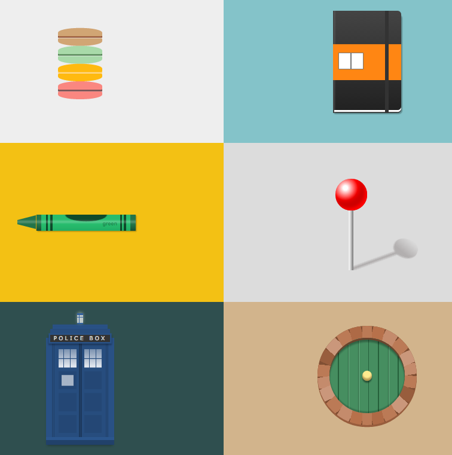
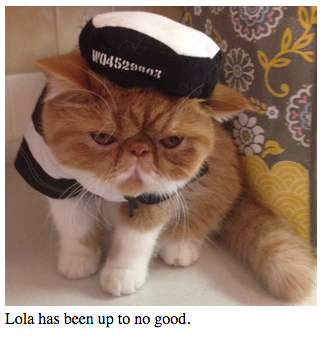
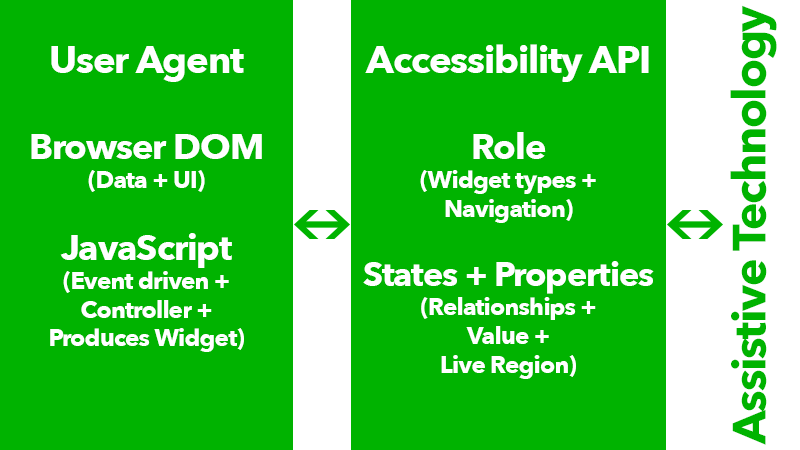

# Accessibility in the Browser

---

# Cassidy Williams
##[fit] Software Engineer & Developer Evangelist at Clarifai <br> *cassidoo.co*

---

# The internet is great.
###[fit] http://www.nooooooooooooooo.com/

---

## If you can see the screen.

---

## If you can use the mouse to click a button.

---

## If you can hear the audio that plays when you click it.

---

## That is, if you have *no disabilities* of any kind.

---

## The web has amazing potential for people with disabilities.

---

## Most studies find that about *20% of the population has some kind of disability.*

---

# So, why aren't we accounting for them?

---

# What we're gonna talk about today
- The Semantic Web
- WAI-ARIA Specification
- Accessibility Checklist for your projects
- Preguntas

---

# The Semantic Web

---

# Semantics is the science of meaning

^ Assign states, roles, and properties to user interface and content elements

---

# The Semantic Web
- HTML5 Tags
- The `role` attribute

---

# HTML5 Semantic Tags
### Probably the easiest thing you can do to make your site more accessible is to use them.

^ I won't talk about this long.
^ With the magic of CSS today, anything can look like anything.  
^ A link can be a button, a list can be a control interface, and whole pieces of artwork can be done with one <div>.

---



---

# These possibilities are great.

---

## But let's look at *a.singlediv.com* with a screen reader.

---

# The `role` attribute
Provides a programmatically determinable *relationship* between specific content.

---

```
	
	<p>Lola has been up to no good.</p>
```


---

```
	<figure role="group">  
		
 		<figcaption>Lola has been up to no good.</figcaption>  
	</figure>
```


^ It looks the same to us, but to someone with a screen reader, it makes a difference!

---

## Adding a role will not make an element act or look differently for people not using assistive technology.

^ It does not change the behaviours, states, nor properties of the host element.
^ It changes the accessibility tree.
^ which is a tree of accessible objects that represents the structure of the user interface (UI).
^ Each node represents an element in the UI as exposed through the accessibility API;
^ for example, a push button, a check box, or container.

---

## The WAI-ARIA Specification
### W3C's Accessible Rich Internet Applications Spec

---

## The WAI-ARIA Specification
### Defines ways to make Web content and Web applications more accessible to people with disabilities.

---

# The Contract Model with Accessibility APIs


---


---

# There are *4 rules* for ARIA use.

^ If you look at the W3C website on ARIA, there's actually 5 rules, but the ones I talk about here are most relevant.

---

# Rule #1
If you can use a native HTML element or attribute, then do so.

^ If native has what you need already built in, don't just repurpose it and add an ARIA role. Use the original.

^ There are exceptions to this rule: if design constraints rule out the use of a particular native element
^ because the element cannot be styled as required.  Or, if accessibility support hasn't been implemented for that particular tag.

---

# Rule #2
Do not change native semantics, unless you *really* have to.

---

## If you want your heading to be a button, do this:

```html
<h1><button>This is a heading AND a button</button></h1>
```

## And not this:

```html
<h1 role=button>This is a heading AND a button</h1>
```

---

# Rule #3
All interactive ARIA controls must be usable with the keyboard.

^ If you make a widget where a user can click or tap or drag or drop or slide or scroll, a user must also be able to navigate to the widget and perform an equivalent action using the keyboard.

---

# Rule #4
All interactive elements must have an accessible name.

---

## Bad: An input with a label
```html
<label>Favorite Taco Brand</label> <input type="text">
```

## Good: An input with a label with a name
```html
<label for="taco">Favorite Taco Brand</label> <input type="text" id="taco">
```

^ No accessible name on the first one. It's not obvious at first that the label is for the input.

^ An element only has an accessible name when it's Accessibility API accessible name property has a value.

---

# ARIA Examples

^ there are so many different roles and properties that it would take a whole day to go through them all, so here's some

---

## `aria-describedby`
### Specifies a hyperlink to content that describes the object.

---

# `aria-describedby`

```


<div id="lola-desc">Lola has been up to no good.</div>
```


---

# `aria-describedby`

```


<div id="lola-desc">Lola has been up to no good.</div>
```


---

# University of Illinois' Example
http://test.cita.uiuc.edu/html/labels1.php

---

## Roles:
 - role="application"
 - role="button"

---

## States and properties:
 - aria-controls
 - aria-pressed
 - aria-labelledby

---

# Accessibility Checklist for your projects

---

# Visibility

^ Techniques like z-index, opacity, and placement for hiding things might not always fly

 - Use the visibility or display properties, or the hidden attribute
 - Don't override too many of the browsers' default behaviors

---

# Color
There should be a certain amount of *contrast* in your color choices.

---

# Focusability
 - Everything on the page should be able to have focus
 - If a control on the page isn’t standard, they should have an appropriate ARIA role attached to them

---

# State Changes
Standard controls have this taken care of, but for custom controls, ARIA states provide solutions (aria-checked, aria-pressed, etc)

^ Be device independent! Don’t use device-dependent events like onKeyDown, onMouseDown, onMouseOver.
^ Instead, use independent events like onFocus, onBlur, onSubmit.

---

# Developer Tools

[Fang’s Screen Reader Emulator](https://addons.mozilla.org/en-US/firefox/addon/fangs-screen-reader-emulator/)
[WAI-ARIA Best Practices](http://www.w3.org/WAI/PF/aria-practices/)
[Color Contrast Checker](http://snook.ca/technical/colour_contrast/colour.html)
[Tanaguru’s Automated Accessibility Testing Service](http://www.tanaguru.com/en/)
http://www.html5accessibility.com/

---

# Let's make the web accessible by everyone.

^ Accessibilty helps some users and doesn't harm any

---

# Cassidy Williams
## cassidoo.co <br> github.com/cassidoo
