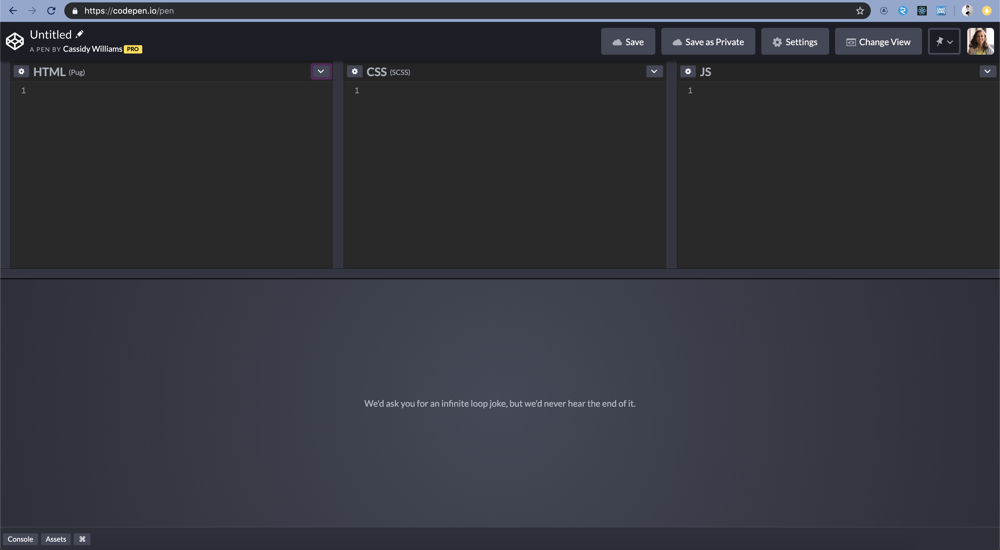
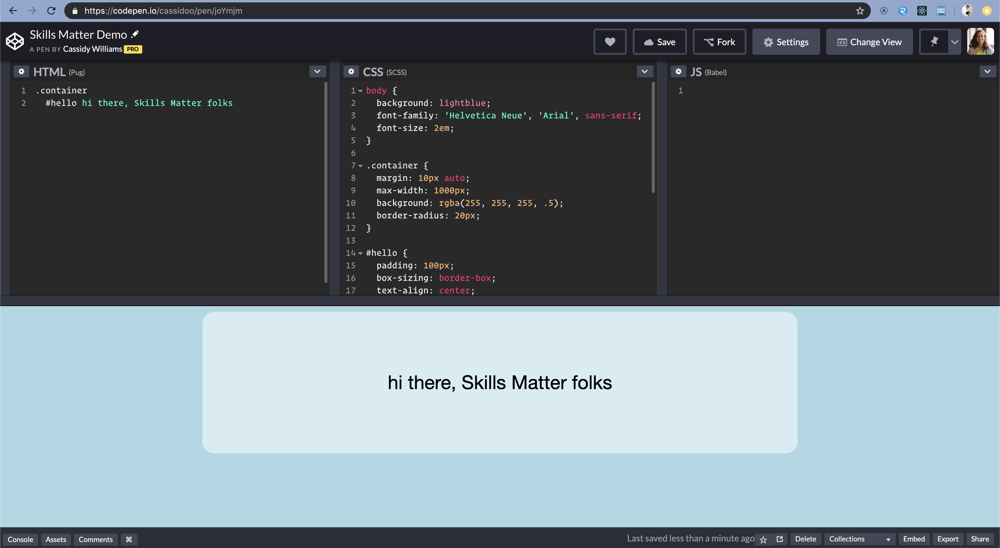
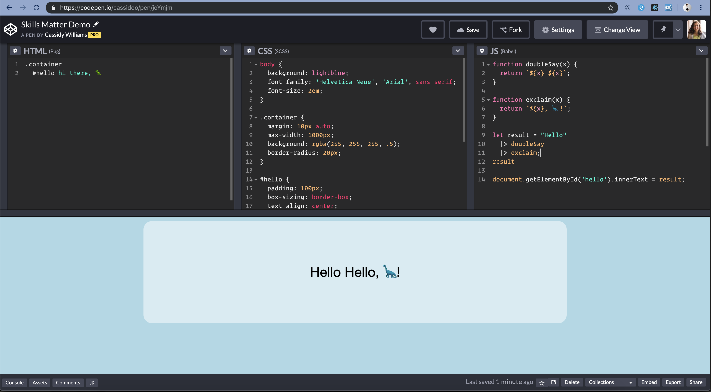

footer: @cassidoo

# [fit] Building JavaScript

# [fit] **For JavaScripters**

---

## Cassidy Williams

### **@cassidoo**

---


---

# For those who don't know

- CodePen is an online code playground
- It was founded in 2012
- People use it to demo and prototype projects, as well as to make art
- There's millions and millions of Pens on the site
- You can get a Pro account to have private Pens, team accounts, different modes, and moooore

---

## The Pens

---



---



---



---

```js
function doubleSay(x) {
  return `${x} ${x}`;
}

function exclaim(x) {
  return `${x}, 🦕!`;
}

let result = 'Hello' |> doubleSay |> exclaim;
result;

document.getElementById('hello').innerText = result;
```

---

### Let's go back in time

---

## Let's go back in time

- It was very "vanilla" Babel
- babel-polyfill was needed for extra features
- Infinite loop detection was off for both JS and Babel
- Extra plugins didn't work fully

^ like async/await
^ Pages would hang on infinite loops and broke the site, basically
^ You had to weirdly stick in your own plugins that didn't always work
^ Some syntaxes like JSX would sometimes just error out

---

## What we wanted

---

## What we wanted

- Babel 7, obviously
- All the plugins
- An extendable interface for future things :eyes:
- Infinite loop detection

---

## Entering...

## **@babel/standalone**

^ At first, it looked like using this plugin would be all we needed

---

```js
import { all } from './generated/plugins';
import preset2015 from './preset-es2015';
import presetStage0 from './preset-stage-0';
import presetStage1 from './preset-stage-1';
import presetStage2 from './preset-stage-2';
import presetStage3 from './preset-stage-3';
import presetReact from '@babel/preset-react';
import presetFlow from '@babel/preset-flow';
import presetTypescript from '@babel/preset-typescript';
```

^ This had all the plugins, and presets, and looked great
^ But, unfortuantely, it wasn't extendable

---

## We had to do it ourselves

---

# Plugins and Presets

---

## **Browser Support**

^ CodePen stopped supporting old versions of IE last summer
^ We checked the numbers anyway to help decide presets
^ Of the multimillion sessions in a given month, about 1000 used IE11
^ a grand total of 12 used IE10 or lower

---

## Thus, we axed all compilation to ES2015

^ People use let and const and arrow functions and template strings now natively
^ We don't have to convert those anymore

---

## We had to be explicit

^ Not swearing
^ But including every plugin we wanted instead of presets

---

### `[swear words lol]`

---

```
@babel/plugin-proposal-class-properties
@babel/plugin-proposal-decorators
@babel/plugin-proposal-do-expressions
@babel/plugin-proposal-function-bind
@babel/plugin-proposal-function-sent
@babel/plugin-proposal-json-strings
@babel/plugin-proposal-logical-assignment-operators
@babel/plugin-transform-modules-commonjs
@babel/plugin-proposal-nullish-coalescing-operator
@babel/plugin-proposal-numeric-separator
@babel/plugin-proposal-optional-chaining
@babel/plugin-proposal-pipeline-operator
@babel/plugin-proposal-throw-expressions
@babel/plugin-syntax-jsx
@babel/plugin-transform-react-display-name
@babel/plugin-transform-react-jsx
```

^ By not using presets of bundles of plugins and just using plugins alone, we could debug easier
^ It gives us more control, and if users want a new plugin, we set it up so we can just plop it in

---

## Custom Plugins

---

## Custom Plugins

- Visitor Plugin
- Infinite Loop Plugin

^ We won't get into the visitor plugin much today, but it parses the code and adds webpack statements where additional compilation would be needed for Pens

---

## Infinite Loop Plugin

- You have to navigate the Abstract Syntax Tree
- You can detect all loops and then watch them for an end

---

## Infinite Loop Plugin

```js
function({ types: t }) {
  return {
    visitor: {
      DoWhileStatement(path) {
        injectLoopWatcher(t, path);
      },
      ForStatement(path) {
        injectLoopWatcher(t, path);
      },
      WhileStatement(path) {
        injectLoopWatcher(t, path);
      }
    }
  };
}
```

^ injectLoopWatcher would run the loop, look for an exit statement
^ if it didn't exist, it would halt execution to save the page from breaking

---

# Babel Config

---

## Babel Config

- It determines what is returned by Babel
- We pass our plugins into it
- Docs here: babeljs.io/docs/en/options

---

## Babel Config

```js
{
    code: true,
    comments: true,
    compact: false,
    plugins: getPlugins(),
    retainLines: true,
    sourceMaps: false
  }

```

^ We had a few other options that aren't necessary for this talk
^ code is when you want the direct code result, usually if you don't it means you want the abstract syntax tree instead
^ we don't need source maps because it just loads straight into the Pen as one file

---

# [fit] Babel Processor

---

## Babel Processor

1. Build the custom CodePen Babel 7 config
2. Process the code
3. Check for errors, code and import errors
4. Build a response to a valid transpile

---

## Processing

---

## Processing

- Build a valid instance of the Babel library
- Transpile JS using the Babel library

---

```js
const transpileWithBabel = (textInput, babelOptions) => {
  const validConfig = babelConfig.buildValidConfig(babelOptions);
  const transpiled = babelTransformSync(textInput, validConfig);

  const { code, metadata } = transpiled;
  const { assets } = metadata;

  return {
    assets,
    code,
  };
};
```

---

## Errors

---

## Errors

- Validate imports in JS are valid
- Find missing dependencies
- Make sure code can run

---

```js
const getExceptionErrors = error => {
  const line = error && error.loc ? error.loc.line : 1;
  let { message } = error;

  return [
    {
      message,
      code: ERRORS.PROCESSING,
      info: {
        level: LEVELS.ERROR,
        line,
        version: '',
      },
    },
  ];
};
```

---

## Client Response

---

## Client Response

- Report errors with messages and line numbers
- Give the caller the processed code and bundle data response it needs to build the final template

---

```js
const processFile = config => {
  try {
    const babelOptions = buildBabelOptions(config);
    const transpiled = transpileWithBabel(config.textInput, babelOptions);

    const { code } = transpiled;
    const { dependencies } = babelOptions;

    return {
      code,
      errors: findErrors(),
    };
  } catch (error) {
    return buildErrorResponse(config, error);
  }
};
```

---

### **phew**

---

# Tests!

---

## Tests

- Babel tests, plugin tests, client tests, and mooore
- We individually tested every plugin and function

---

```js
test('compiles optional chaining', () => {
  const content = `
      const obj = {
        bar: { baz: 42 }
      };

      const baz = obj?.bar?.baz;
    `;
  const config = testGlobals.getBabelConfig('babel', {}, true, content);

  const result = babelProcessor.processFile(config);
  const { code, errors } = result;

  expect(errors).toEqual([]);

  const expectedResult = `
    var _obj$bar;
    const obj = {
      bar: {
        baz: 42 } };

    const baz = obj === null || obj === void 0 ?
      void 0 : (_obj$bar = obj.bar) === null || _obj$bar === void 0 ?
        void 0 : _obj$bar.baz;
    `;

  expect(customMatchers.whitespaceMatcher(code, expectedResult).pass).toBeTruthy();
});
```

---

## Hooking it up to the Client

---

### (I did not do this and it's still fairly magical to me)

---

## Hooking it up to the Client

- Importing the Babel Processor lib as an external package
- Setting up a webworker to listen for code changes
- Running infinite loop detection, even when Babel is off
- Setting up the UI to respond and react to errors

---

## **And voilà**

---

## **And voilà**

- Babel 7 :heavy_check_mark:
- All the plugins :heavy_check_mark:
- An extendable interface for future things :heavy_check_mark:
- Infinite loop detection :heavy_check_mark:

---


---

## **Thank you :heart:**

### @cassidoo
