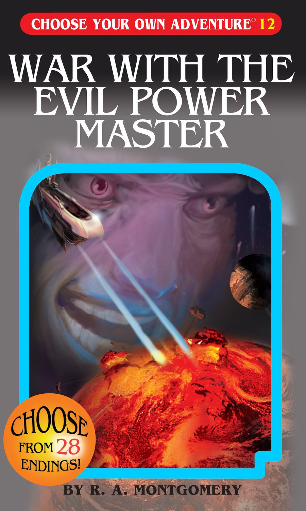
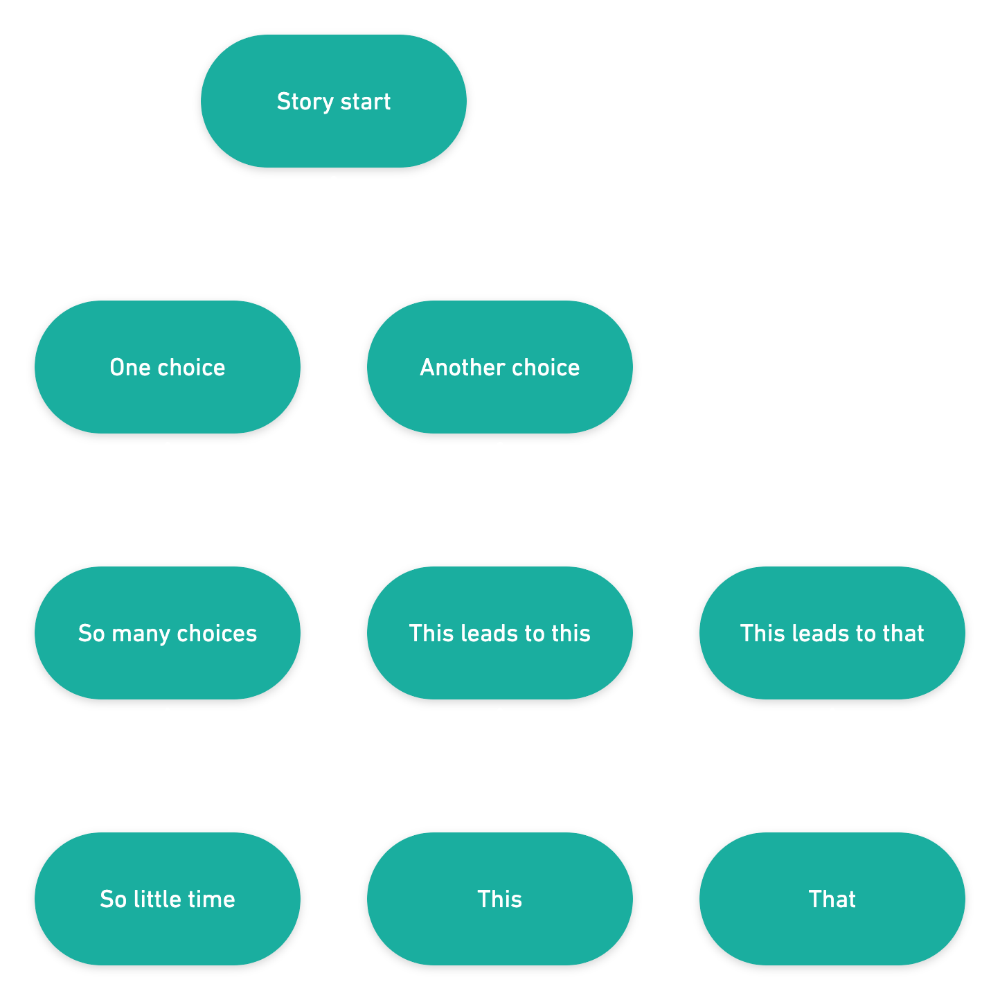
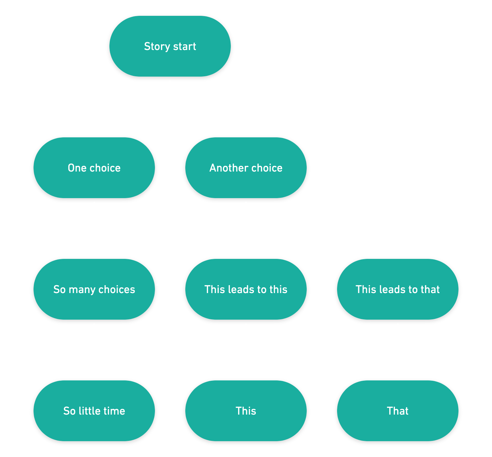

# (Choosing our own) **Adventures in Next.js**

---

# Cassidy Williams
## **@cassidoo**

---

---

# I wanted to build one of these!

---

# Picking a **data structure**

---

## Trees!

---

---

## Graphs!

---

---

## Directed Graphs!

---

---

## State Machines!

---

---

## User Input Driven State Machines!

---

# Picking **tools**

---

## XState

---

## XState + React

---

## XState + React + Next.js

---

## Netlify Forms

---

## Netlify Functions

---

## Hasura

---

## A Spooky Brain

---

## ALL POWERS COMBINED

---

## Why Next.js?

---

## What features should I know about?

---

## Developer Experience Nice-to-Haves

---

## Developer Experience Nice-to-Haves

- Hot code reloading
- Styling options
- TypeScript support
- Environment variables built-in
- Automatic code splitting

---

## Routing

---

## The API

---

## The API

- `next/link`
- `next/head`
- `next/router`
- `next/amp`

---

## The CLI

---

## The CLI

- `next build`
- `next dev`
- `next start`
- `next export`

---

## Preview Mode

---

## Incremental Static Regeneration

---

## Custom Configuration

---

## Custom Configuration

`next.config.js`

---

## Anyway...

---

## ALL POWERS COMBINED

---

# Demooooo!

### **github.com/cassidoo/next-adventure**

---

## **next-adventure.netlify.app**

---

# What we've learned

---

# What we've learned

- FUNdamental CS concepts are actually good to know, who knew
- Using tools that are flexible and only prescriptive in small ways is empowering
- Cassidy writes incredibly spooky stories

---

# Thank you!
