#[fit]Convolution Neural
#[fit]Networks in Practice

---

# Cassidy Williams

### Software Engineer & Developer Evangelist at __Clarifai__

---

### Machine Learning → Artificial Intelligence

^ The scope of ML is a little smaller than AI, but it's expanding all the time. The line between the two terms is increasingly blurred.

^ For all intents and purposes, machine learning is artificial intelligence.

---

“A computer program is said to learn from experience E with respect to some task T and some performance measure P, if its performance on T, as measured by P, improves with experience E.”

__Tom Mitchell, 1997__

^ Tom Mitchell is the professor who created the fundamentals of machine learning.

---

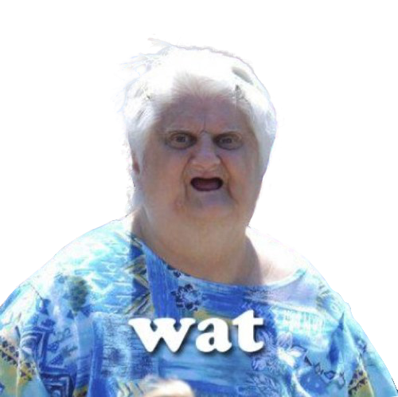

---

^ I'll simplify this with an example.  Let's say your machine is a computer.

---

^ You want the computer to learn how to tell where the banana is in a bowl of fruit.

^ In this case, our experience is the bowl of fruit, and the task is to find the banana. Our performance measure could be if the found fruit is yellow, the computer has found the banana.

---

^ So as the computer searches through fruit in the bowl. As the computer finds fruit that are not yellow, it begins to learn what is not a banana, until it finds a yellow fruit. This increase in P represents machine learning.

---

---

---

---

^ It’s learning by the negatives what a banana is.  If there was a yellow apple in there, it might learn that the banana is not only yellow, but it’s also not round.  It learns from both positives and negatives.

---

# So, how does Clarifai do it?

---

# _Neural Networks!_

^ Neural networks are a computer algorithm designed to simulate how the brain works.

^ Nobody really understands how the brain works, but these algorithms exhibit some of the properties that the brain has been shown to exhibit.

---

## Training phase

#### Take pairs of input data and desired output that has been collected beforehand

^ In every neural network, there is a training phase. They can follow any parameter.

^ For Clarifai, the input data is images and the categories of concepts are the output.  Clarifai started with 10,000 categories (now 11,000) that had parameters for an input to fit into.

---

## The easy to understand way...

#### (Clarifai does not do this)

---

## Adjacenct Neural Networks

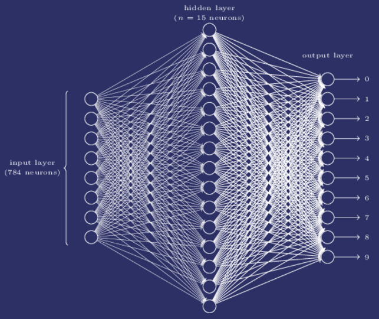

^ This might look familiar because it’s one large map.

^ It takes positives and negatives, and creates nodes that match up with those positives and negatives. You can have many layers. As you train concepts and create parameters, it starts to create a network.

^ Each node carries a confidence, and the highest one is followed and then calculated at the end.

^ For images, the input would be images, the hidden later is characteristics of the image, and the output would be tags.

---

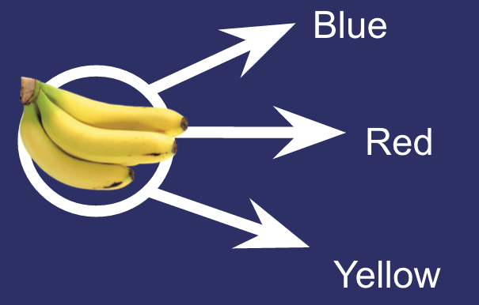

^ At the start of the training phase the parameters start off at random.  This is the input layer.  Anything past the input is a hidden layer (except the output).

---

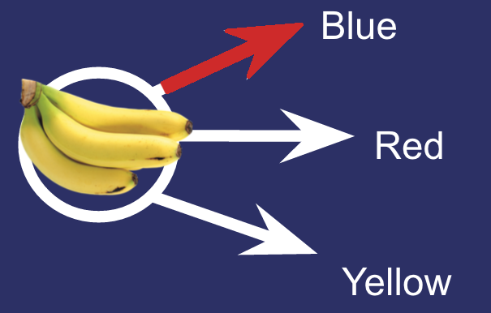

---

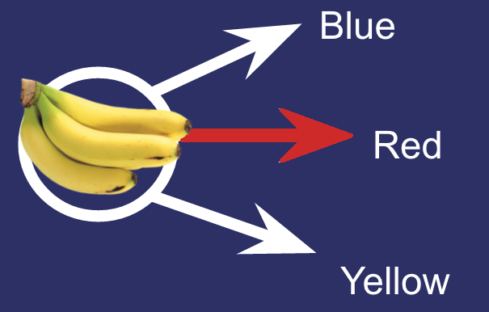

---

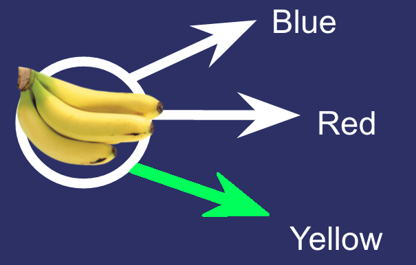

---

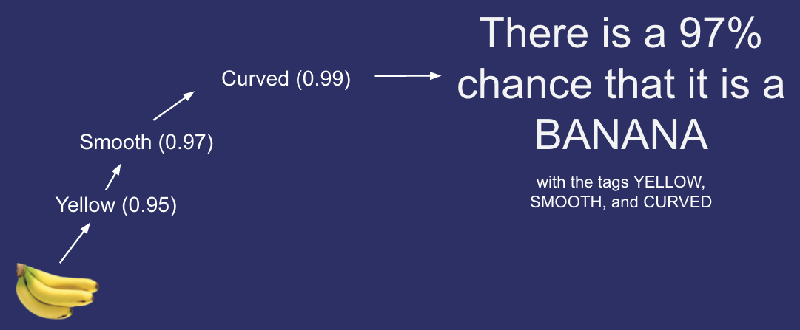

^ So each of these have a confidence level, and the average of these lead to the confidence of the banana.  It’s looking at the picture as a whole, and the characteristics of the major aspect of the image (Adjacency does this).

---

## Then there's the AWESOME WAY.

#### (Clarifai does do this)

---

# Convolution Neural Networks

---

# Convolution Neural Networks

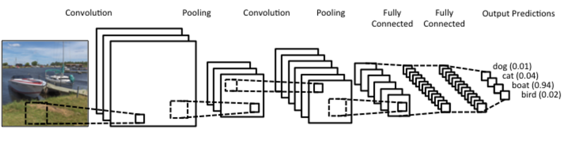

---

#__Local Receptive Fields__

a window on the input of pixels

---

#__Feature Map__

mapping from input layer to hidden layer

---

#__Shared Weights__

positive or negatives on a feature map

---

#__Pooling__

simplifying the information from the feature maps

---

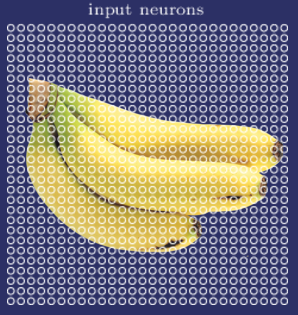

^ Neurons are groupings of NxN pixels.  At Clarifai, we just do 1x1.

---

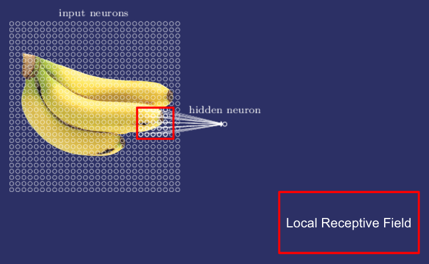

^ Local receptive fields are MxM neurons.

---

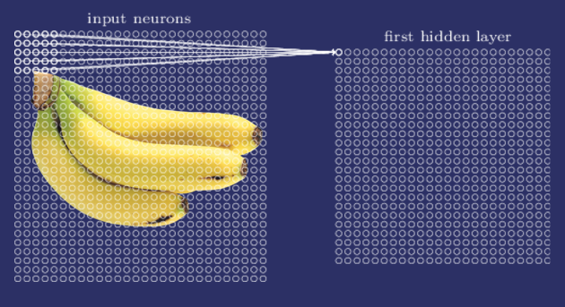

^ Let's start with a local receptive field in the top-left corner.  We’re compressing it and mapping it to a neuron on our first feature map, which will create our first hidden layer (a hidden layer can’t exist without a feature map).

---

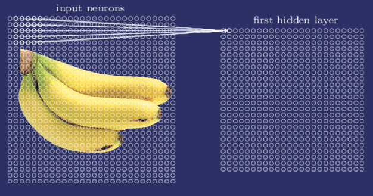

^ Then we slide the local receptive field over by <=M neurons to the right, to connect to a second neuron on our feature map.  A feature map is a definition of one characteristic.

---

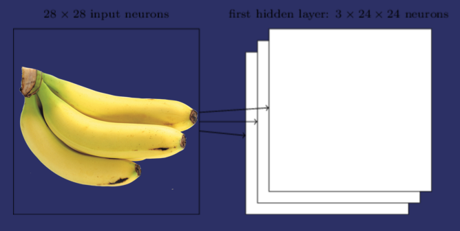

^ So, because each feature map is one characteristic, to do image recognition we'll need more than one feature map. And so a complete hidden layer consists of several different feature maps.  The act of splitting the image into neurons, creating a local receptive field, compressing that into a neuron on a feature map, and building a hidden layer out of your feature maps, is called convolution.

---

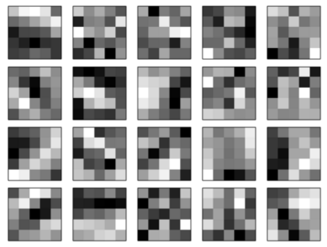

^ This whole thing is a hidden layer, the smaller boxes are feature maps, and the little boxes are neurons from the local receptive field. Whiter blocks are positive, dark blocks are negative.

---

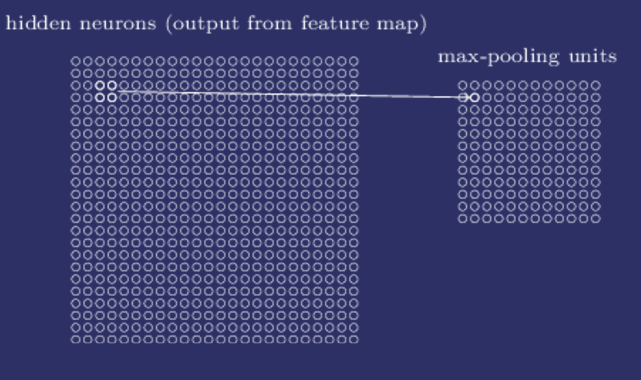

^ Pooling takes the feature maps from convolution and makes a condensed feature map based on it (very similar to convolution, only just on the feature maps in that first hidden layer).

---

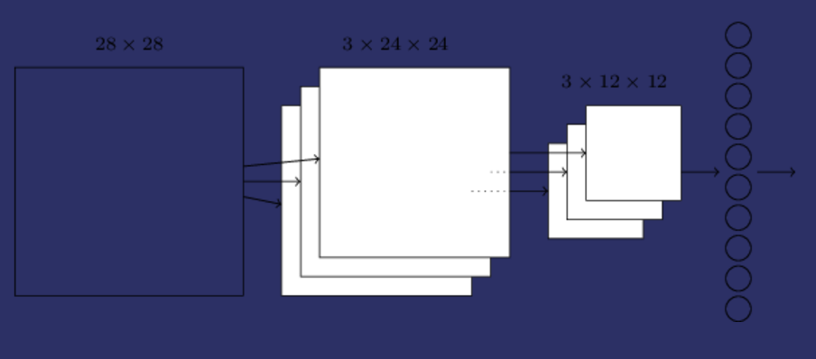

^ You might be wondering, since we’re doing it pixel by pixel, we might be learning the location of the characteristic of an image.  But, we can either hold on to that location or hold on to the characteristic (this is how all neural networks are).  We hold on to the characteristic, because it’s our job to define what’s in the image, rather than just a list of pixel dimensions of ~things~ in the image.

---

^ The network begins with input neurons, which are used to encode the pixel intensities for the image. This is then followed by a convolutional layer using a local receptive field and multiple feature maps to find multiple characteristics of the image. The result is a layer of hidden feature neurons. The next step is a pooling layer, applied to regions of each of the feature maps. The result is a layer of hidden feature neurons. The final layer of connections in the network is a fully-connected layer. That is, this layer connects every neuron from the pooled layer to every one of the output neurons.

---

# Convolution Neural Networks

^ With each hidden layer, the definitions are all independent of one another (unlike adjacency).  So, we can put each characteristic on its own thread.  The size of the operation actually gets smaller and there are multiple processes happening as with every running feature map.  So, the speed is just dependent on the size of the image, which is O(n)!

---

# Convolution vs. Adjacent

- Convolution: Fast to train, multiple items found
- Adjacent: No recognition of spacial structure, great for finding a single item
- Both: Create multilayer neural network

---

# Did you get that?

---

^ Luckily, Clarifai does!

---

# Thank you!

### __@cassidoo__
