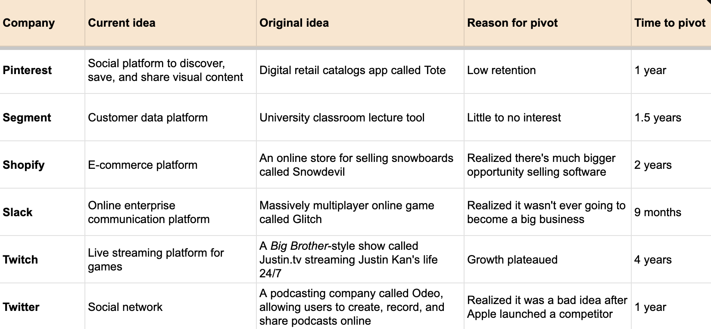

Footer: @cassidoo

# [fit] Embracing the Pivot:
# [fit] **An Engineering Perspective on Adaptability**

^ test speaker note, lol good luck

---

[.hide-footer]

# Cassidy Williams
## **@cassidoo**

---

## This talk was a surprise.

^ Not that I didn't expect it, of course, we pitched these talks to the organizers a while ago, and I did plan on talking about startup pivoting.

^ But the realities of what I'm about to talk about were the surprising parts. I thought I would be focusing on the general concept of how change is inevitable! Nothing is permanent! Build reusable code, good luck! I'd throw the Ross meme in from Friends!

---

## My startup's story

^ But really I ended up reflecting on what I've been working on for the past few years.

---

[.build-lists: true]
[.hide-footer]

## My startup's story

- Stickers
- Streamer subscribers
- Creators resurfacing content
- Creators recreating content
- Technical creators reusing content
- API for transforming media to prompted text
  - High schoolers writing college essays
- Brainstory, for helping you think ideas out loud

---

## I've learned a lot.

^ When you pivot, you're forced to balance the new and the old. What things can you salvage? What things should you throw away?

^ The biggest thing I've learned is that pivots require is not "what code can I write that is future proof?"...

---

## Mindset shift

^ As engineers, we are wired to love our code. It's our baby, that came from our beautiful, beautiful minds.

^ Engineers tend to think of their code as a representation of themselves, because it's something that we built with our own hands, from our own brains.

^ But that's simply not reality.

---

## Your work is **not** permanent

^ layoffs, work, code, blah
^ it's not set in stone!

---

## This is a **good thing!**

^ We shouldn't be so attached to our own work!

^ If we do, we get too stuck to it.

---

## Sunk-cost fallacy

---

## Sunk-cost fallacy

Our tendency to follow through on something that we’ve already invested heavily in, even when giving up is clearly a better idea.

^ (be it time, money, effort, emotional energy, etc.)

---

> "The most dangerous phrase in the language is: **we've always done it this way**."

> — Grace Hopper

---

## Pivoting is more common than you think.

---

[.footer: Source: Lenny's Newsletter]

cass.run/pivots

^ one in three B2B startups, and one in five consumer startups, pivot before finding their big idea

---

## Building flexible systems

^ Flexible, adaptable systems can be actual code components and features, or just workflows and data

---

## Flexible systems

- Actual code components
- Data you have
- Parts of an idea
- Processes

---

[.hide-footer]

## Flexible systems

- Stickers
- Streamer subscribers
- Creators resurfacing content
- Creators recreating content
- Technical creators reusing content
- API for transforming media to prompted text
  - High schoolers writing college essays
- Brainstory, for helping you think ideas out loud

^ my team got better at this over time!

^ coming back to the concept of a mindset shift...

---

## Mindset shift

^ By not letting your work be etched in stone in your mind, you can avoid the sunk cost fallacy of building things that might be too perfect, when they might be better let go.

^ This isn't just confined to small startups, even though it's more likely to happen at startups! Teams go through it all the time. Think about it, Netflix pivoted after 9 years from mailing DVDs to online streaming!

---

## You have to be willing to ask yourself **the scary questions.**

---

[.build-lists: true]

## Scary questions

- Has growth stalled?
- Is retention low?
- Is interest generally lukewarm?
- Is it simply not good enough?

---

> “Seven months in, we only made $600.”

> — Shahed Khan, co-founder Loom

^ A subject-matter-expert marketplace, then a video feedback platform

---

> “The whole thing didn’t make any sense.”

> — Steve Chen, co-founder YouTube

^ Dating site where people upload videos of themselves talking about the partner of their dreams

---

> “Why is everything AI now, I'm so tired”

> — Cassidy, generally okay person

---

## This can also apply to your own projects and teams!

---

[.build-lists: true]

## More scary questions

- Are your systems or processes working?
- Is your codebase... good?
- If you continue to build this way, will your team be successful?

^ are they not?

---

## Fill this out:

|             | like | don't like |
| ----------- | ---- | ---------- |
| good at     |      |            | 
| not good at |      |            |

---

## Fill this out:

|             | like | don't like |
| ----------- | ---- | ---------- |
| good at     |      |            | 
| not good at |      |      delegate      |

---

## Fill this out:

|             | like | don't like |
| ----------- | ---- | ---------- |
| good at     |      |            | 
| not good at |   learning   |      delegate      |

---

## Fill this out:

|             | like | don't like |
| ----------- | ---- | ---------- |
| good at     |      |      optimize      | 
| not good at |   learning   |      delegate      |

---

## Fill this out:

|             | like | don't like |
| ----------- | ---- | ---------- |
| good at     |   prioritize   |      optimize      | 
| not good at |   learning   |      delegate      |

^ Does the thing you're working on call under your priorities? Should your effort be spent somewhere else?

---

## Pivots are scary.

^ It's super easy to say all of this, but actually doing it is definitely challenging.

^ Taking a leap.

^ I could do an entirely separate talk on convincing external stakeholders on why you think you should pivot, which is an entirely separate challenge.

---

## It'S aBoUt ThE jOuRnEy

^ it's so cheesy I couldn't actually handle writing it down normally on this slide, but it really is about the journey, not the destination.

^ it's easy to get discouraged if we encounter setbacks or things don't go exactly as we planned or hoped.

^ when we shift our focus to the present moment and the actions we're taking right now, we're able to stay grounded and motivated, even when things get tough.

^ When we're so focused on the end goal, we can sometimes forget to appreciate the learning moments and exciting breakthroughs along the way. 

---

## Pivots have made me **better.**

^ helped me be a better leader, developer, teammate and better at building products overall because I'm willing to iterate, I'm willing to change and adapt.

---

[.hide-footer]

---

[.hide-footer]

# Thank you!

#### **@cassidoo**

