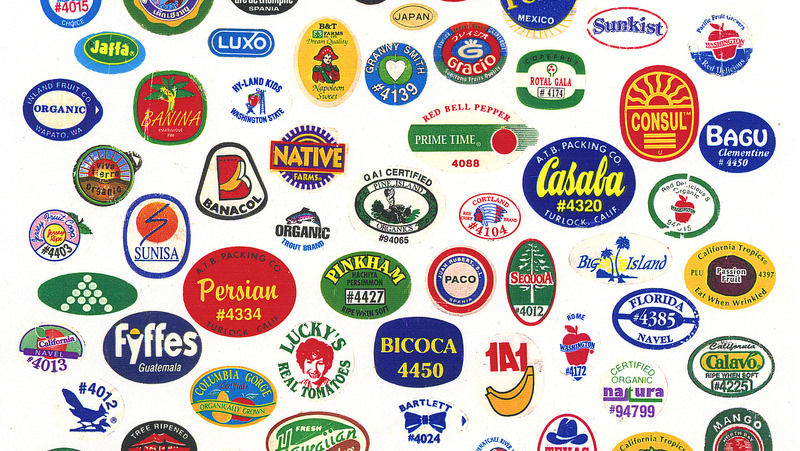

# **Fruit Stickers**

---

I put fruit stickers on my hands.

---

I put fruit stickers on my hands.

I have skin and fruit has skin.

---

I put fruit stickers on my hands.

I have skin and fruit has skin.

**Hypothesis:** fruit stickers should work well on my skin.

---

I put fruit stickers on my hands.

I have skin and fruit has skin.

**Hypothesis:** fruit stickers should work well on my skin.

I have been doing this for more than a decade.

---

I put fruit stickers on my hands.

I have skin and fruit has skin.

**Hypothesis:** fruit stickers should work well on my skin.

I have been doing this for more than a decade.

**Conclusion:** I am a genius.

---

# **Sticker Application**

---

# **Sticker Application**

Stickers always go on my *left* hand, immediately before eating the fruit.

---

# **Sticker Application**

Stickers always go on my *left* hand, immediately before eating the fruit.

They are applied to the back of my hand, in between the tendons of my middle and ring finger, halfway between the knuckle and my wrist.

---

# **Sticker Application**

Stickers always go on my *left* hand, immediately before eating the fruit.

They are applied to the back of my hand, in between the tendons of my middle and ring finger, halfway between the knuckle and my wrist.

I never purposely remove them, unless there's someone visiting who doesn't understand *science*.

---

# **Fruit sticker data**

---

# **Fruit sticker data**

*Banana stickers* win for the longest and stickiest stickers. They typically last at least 3 days on my hand, including showers.

---

# **Fruit sticker data**

*Banana stickers* win for the longest and stickiest stickers. They typically last at least 3 days on my hand, including showers.

*Kiwi stickers* lose for lasting the shortest time and being least sticky stickers. They barely last a day and kind of suck. It's probably because the skin is kind of hairy.

---

# **Fruit sticker data**

*Banana stickers* win for the longest and stickiest stickers. They typically last at least 3 days on my hand, including showers.

*Kiwi stickers* lose for lasting the shortest time and being least sticky stickers. They barely last a day and kind of suck. It's probably because the skin is kind of hairy.

Weirdly, *peach stickers* do really well, even though they have a lot of fuzz. I'm guessing that they have to make them extra sticky __because__ of the fuzz.

---

# **Fruit sticker data**

*Plum stickers* and *tomato stickers* are solidly in the middle. They almost always last at least a day. It makes sense, they both kind of have the same vibe.

---

# **Fruit sticker data**

*Plum stickers* and *tomato stickers* are solidly in the middle. They almost always last at least a day. It makes sense, they both kind of have the same vibe.

On average, most stickers last around a day and a half.

---

# **Fruit sticker data**

*Plum stickers* and *tomato stickers* are solidly in the middle. They almost always last at least a day. It makes sense, they both kind of have the same vibe.

On average, most stickers last around a day and a half.

The *shape* doesn't seem to impact how long they stick.

---

# **Fruit sticker FAQs**

---

# [fit] **Fruit sticker FAQs**

# **_Are they edible?_**

Maybe. Their glue is FDA regulated. But also the glue is different for fruits that have skin that you usually eat (like an apple) and don't eat (like a banana).

---

# [fit] **Fruit sticker FAQs**

# **_What do the numbers mean?_**

4 digits on a fruit sticker means it's conventionally grown. 5 digits that start with an 8 mean it's genetically modified. A code that starts with a 9 means it's organic.

So a regular banana might be #4011, but an organic banana might be #94011.

---

# [fit] **Fruit sticker FAQs**

# **_How long have fruit stickers been around?_**

Since around 1990, that's when fruit price lookups were first regulated. The International Federation for Produce Standards (IFPS) gives out the stickers all across the world.

---

# [fit] **Fruit sticker FAQs**

# **_Are fruit stickers the future?_**

Yes. But also meh. They're not always biodegradable. Pretty seedy, amirite? There's a new FDA-regulated laser-etched label process that has come up, but it's very uncommon and still being experimented with.

---

# **Conclusion**

---

Thanks a *bunch* for your time.

---

Thanks a *bunch* for your time.

I hope this has been *fruitful* for you.

---

Thanks a *bunch* for your time.

I hope this has been *fruitful* for you.

I hope you found it *appeeling*.

---

Thanks a *bunch* for your time.

I hope this has been *fruitful* for you.

I hope you found it *appeeling*.

If not, it's not a *fig* deal.

---

Thanks a *bunch* for your time.

I hope this has been *fruitful* for you.

I hope you found it *appeeling*.

If not, it's not a *fig* deal. (Figs do not have stickers.)

---

Thanks a *bunch* for your time.

I hope this has been *fruitful* for you.

I hope you found it *appeeling*.

If not, it's not a *fig* deal. (Figs do not have stickers.)

I had a *berry* good time delivering this talk.

---

Thanks a *bunch* for your time.

I hope this has been *fruitful* for you.

I hope you found it *appeeling*.

If not, it's not a *fig* deal. (Figs do not have stickers.)

I had a *berry* good time delivering this talk.

*Orange* you glad you listened to it?

---

Thanks a *bunch* for your time.

I hope this has been *fruitful* for you.

I hope you found it *appeeling*.

If not, it's not a *fig* deal. (Figs do not have stickers.)

I had a *berry* good time delivering this talk.

*Orange* you glad you listened to it?

I'm *grapeful* for all of you.

---

Thanks a *bunch* for your time.

I hope this has been *fruitful* for you.

I hope you found it *appeeling*.

If not, it's not a *fig* deal. (Figs do not have stickers.)

I had a *berry* good time delivering this talk.

*Orange* you glad you listened to it?

I'm *grapeful* for all of you.

Bye.