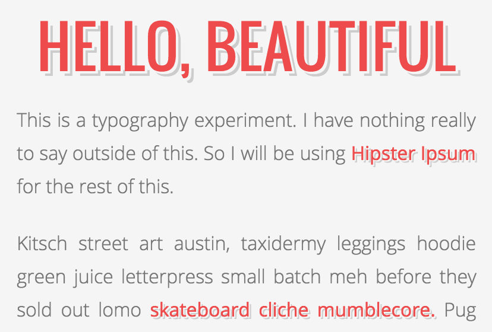
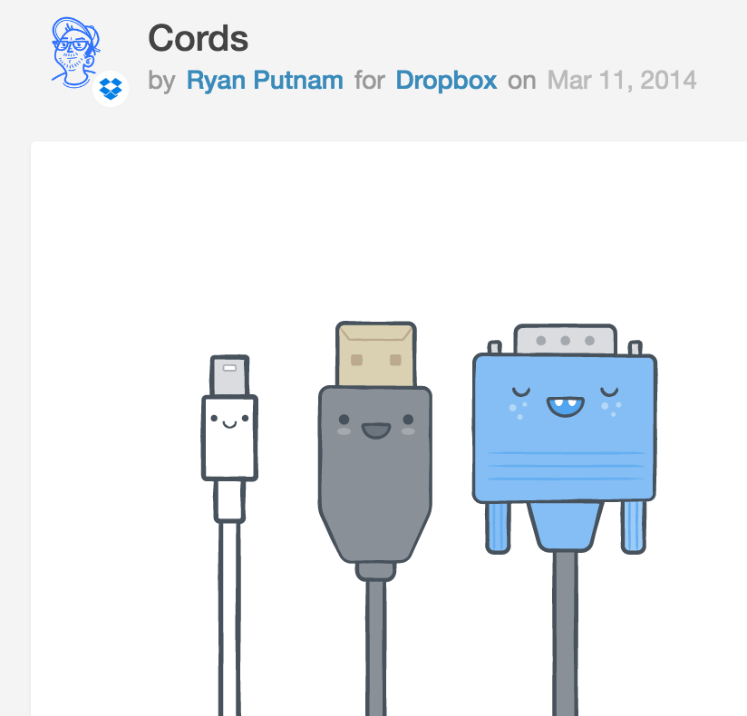
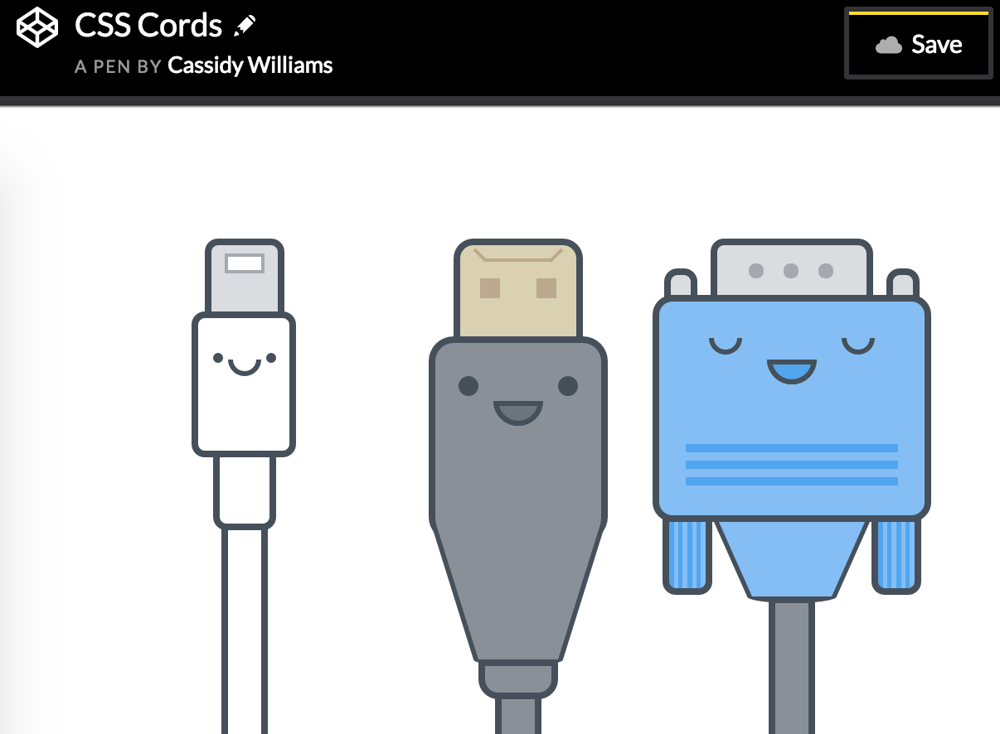
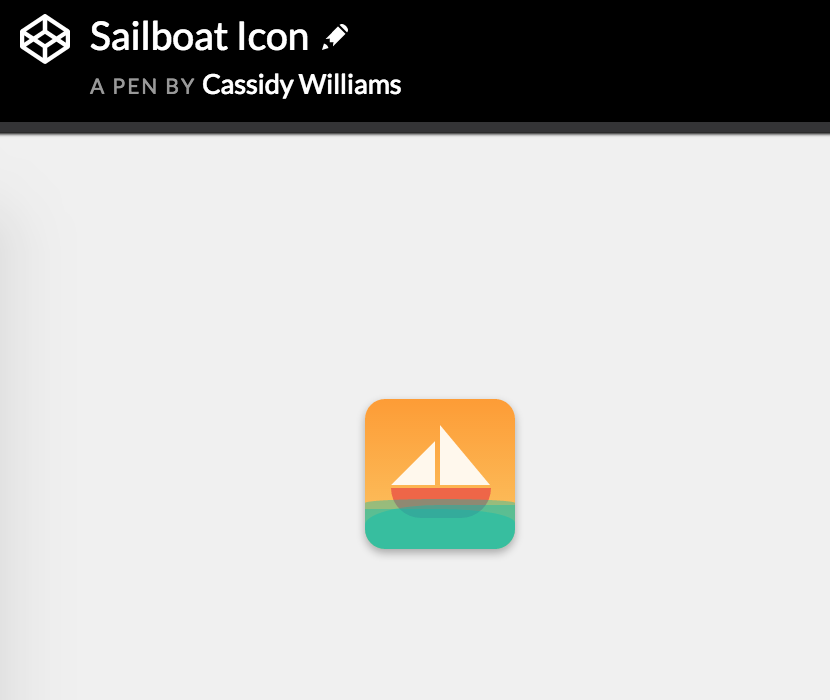
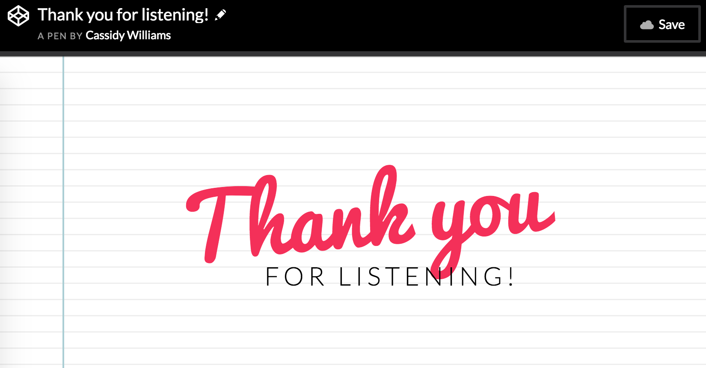

# Learning to be Creative by Copying

---

## **Cassidy Williams**
### Software Engineer & Developer Evangelist at *Clarifai*

---

I am a fraud.

^ So, you might have noticed, I am NOT a designer. Or photographer. Or artist.
^ This might be impostor syndrome speaking.
^ I am an engineer.  Anti-social.  Nerdy.  By the numbers.

---

But, I really, *really* like art.

^ I appreciate it.  I love looking at it.  I want to make it.

---

So, I started brainstorming.

^ I stared at Dribbble for hours, I started pinning things on Pinterest, and I filtered my Instagram feed to be full of artists and designers.

---

I had all of this inspiration at my fingertips, but didn't have the ability to make things on my own.

---

All I had was code.

^ So, I decided to copy the amazing things I saw online with just code.

---

I started by copying font combinations.

^ I started to learn more about kerning and line spacing and font readability and shadows and styles.

---

Then I started copying icons.

^ I started to learn more about spacing things out, gradients, and colors.

---

Then I started copying larger graphics.

^ Now I was getting pretty darn confident in CSS, and started learning how to be consistent across a specific design, and also seemingly silly things, like "what makes something cute"

---

Eventually, I started applying my skills learned from copying to my own work.

---

And then I tried to even do artsy things *without code*.

---

Now, I know I'm not the only person to learn by copying.

# I copied that.

---

> "Copying is one of the best ways of learning, growing, evaluating, and exploring. It’s a valid tool so long as we regard it as a means to an end."

Jason Cohen, Founder of WP Engine

---

### I encourage you to copy when you are trying new things.

^ It makes you better informed on new styles, and can improve your ideas about them.
^ You can't help but learn when you are copying.
^ It teaches you to see things the way other people see them.

---

## _Copy to be copied!_

^ One of my favorite quotes is "lift as you climb". As you progress in your career as a designer, developer, artist, businessperson, etc, new people will need just as much help as you might now. Help them pay it forward!

---

