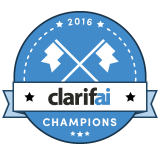
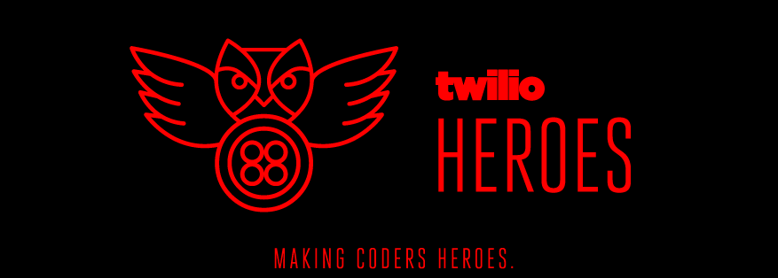
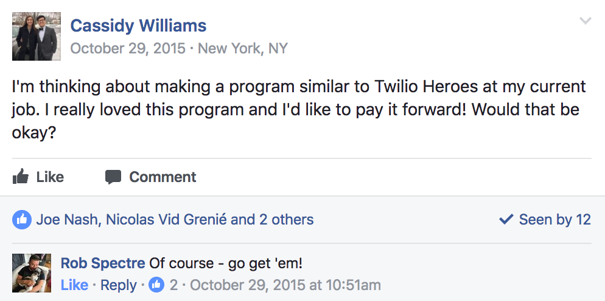
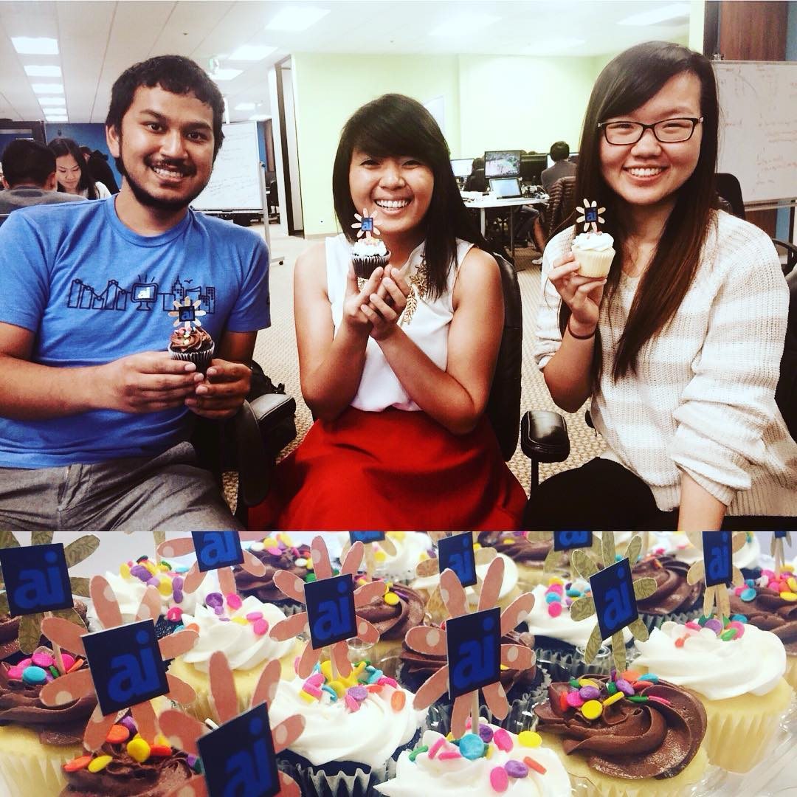

#[fit] Lift as you Climb
##[fit] **Training new evangelists as you grow**

---

#[fit] Cassidy Williams
### **@cassidoo**

---

> "Lift as you climb"

^ This phrase is one that a mentor told me when I was first entering the workforce.
^ She told me that those who are great are both mentored and mentor others who are great.
^ That being said, I think that it's not just great people this applies to, but companies and teams as well.

---

^ As your brand grows, you will inevitably need to expand your team and community to the next level.
^ But, as you know, there's only so many evangelists on the market in this ever-growing field.

---

#[fit] If you can't find them
#[fit] **Make them yourself**

^ So, what do you do when you can't find evangelists to hire? You create hireable evangelists.
^ You make your users your evangelists.

---

---

---

^ Flashback to 2015, I joined small startup Clarifai as their 17th employee.

---

^ My sister and I were the only two evangelists in the company, and we had to show their awesome technology to the world, somehow.
^ We did the standard "go to hackathons and conferences and meetups all the time" thing, but that was not only tiring, but limited because of our small team.

---

^ Thus, the Clarifai Champions were born!

---

^ Quick flashback, back when I was in school, Twilio started a 6-month evangelism training program.
^ There were 12 of us in the program, and it started strong and sort of tapered off at the end because of schedules of both the participants and the evangelists.

---

^ After asking politely if we could rip off Twilio's idea...

---

^ The Clarifai Champions were born!

---

# The Champs program (overview)

- 3 months long
- 4 separate segments focusing on:
  - Public speaking
  - Technical Writing
  - Events + Mentorship
  - Technical Demos + Projects

^ Our program was a little different from the Twilio program. It was shorter, we used Slack for communication, and we talked with the Champs every day.

---

# The Champs program (specifics)

- 1 video lecture every 3 weeks
- Office hours every week
- "Homework" assignments for every segment
- Detailed feedback for each assignment turned in
- Ongoing Slack discussions throughout the program
- First cohort had 27 Champs, next cohort had 45
- Top Champs got flown to our NYC office

---

# Things that were easy and fun

- The lectures
- The office hours
- The Slack chatter

---

---

# Things that were a challenge

- Grading assignments for everyone
- Going through applicants
- The Slack chatter

---

# Benefits for the company

- Monthly active users jumped up
- API usage hit new areas of the world
- Champs' blog posts and API projects could be promoted by marketing
- Company reputation in the hackathon community felt more established

---

# Benefits for the Champs

- Tight-knit community of dev evangelists
- Practical experience for necessary skills
- Connections to people in the industry
  - Including job recommendations
- Swag (of course)

---

#[fit] **You** can do this, too!

---

# **You** can do this, too!

The next generation of evangelists are out there, they just don't know it yet!

^ Computer science graduates, hackathon goers, open source contributors, bootcamp grads, they all have the passion for coding. They often also have the passion for the community, too.

---

# Your job is to train them how to **communicate**

^ Through projects for your company, they can exercise their speaking, writing, mentoring, and social skills.
^ It's a self-selecting group. Their passion is there, you just have to help guide it.

---

# Any questions?

---

#[fit] Thanks!

# **@cassidoo**
