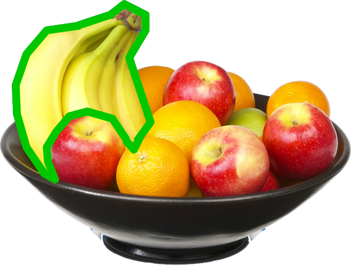

#Machine Learning + Clarifai
##Cassidy Williams
###@cassidoo

---

##What actually *is* machine learning?

---

“A computer program is said to learn from experience E with respect to some task T and some performance measure P, if its performance on T, as measured by P, improves with experience E.”

---

---

^ You want the computer to learn how to tell where the banana is in a bowl of fruit. In this case, Experience = the bowl of fruit, Task = find the banana. Performance could be = fruit is yellow.

---

^ Computer searches through fruit. As the computer finds fruit that are not yellow, it learns what is not a banana.

---

^ ...until it finds a yellow fruit. This increase in Performance represents machine learning.

---

#Cool story, bro.

---

#What now?

---

github.com/clarifai
