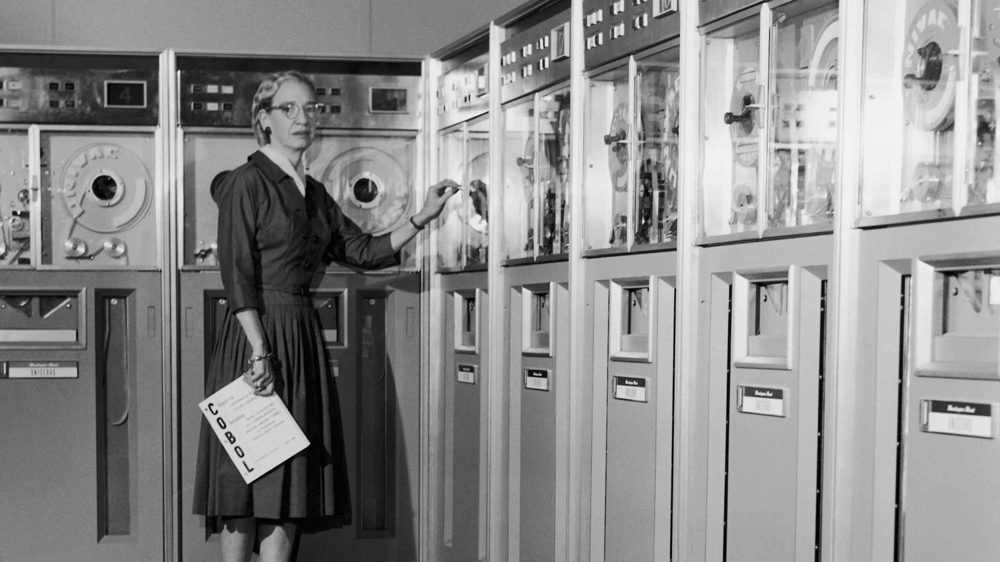
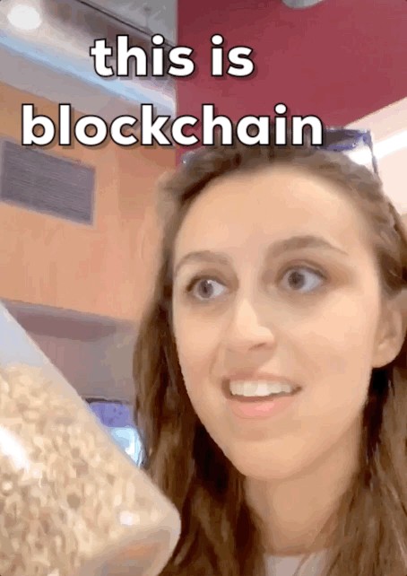
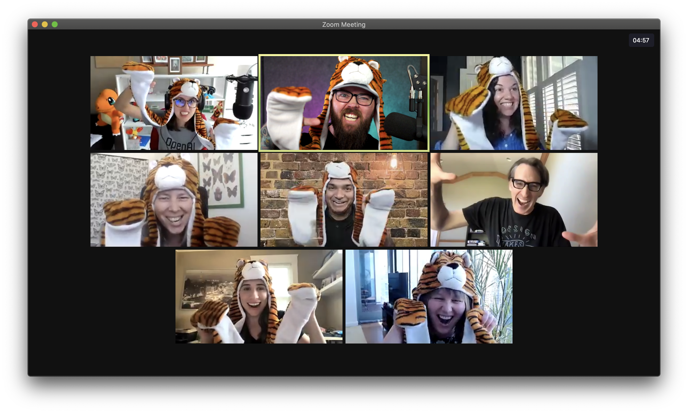

# MDD: **Meme-Driven** Development

---

## Cassidy Williams
### **@cassidoo**

---

## We all love memes.

^ If you don't, you can probs just sign off now, no hurt feelings.
^ I'm going to attempt to give this entire talk without sharing any memes at all.

---

^ okay just one

---

## Tech is a pretty serious industry.

^ Everyone always talks about optimizations, metrics, performance, scaling, and... a lot of other boring things.

^ We often solve problems that most folks don't even think about, and a lot of our work can be kind of dreary.

^ Looking at tech Twitter is often just watching arguments in real time.

---

## "Conventional solutions are not the only solutions."
### **- Grace Hopper**

^ teams everywhere feel the stresses of tech's problems
^ there's a commonly known story about how Grace Hopper found the first bug in a computer because it was an actual moth that was in there. later:
^ she wanted a day off, and was tired and wasn't having it. She went to a local joke shop, and bought fake bed bugs and put them in the Mark I computer in the relays, and so their giant, 50ft computer stopped working, and everyone got the day off. 
Of course then, her commanding officer Charles Aiken got all the best vacuums he could find to clean out the Mark I. But he ended up cleaning it so much that the relays weren't firing anymore, and everyone got 2 weeks off instead.

---

## Memes
## **humanize!**

^ This is probably the most fun story you've ever heard about Grace Hopper.
^ This is actually how I got into the meme-making biz. Not biz. Tomfoolery? Anyway.
^ A couple years ago, there were some popular threads happening about how tech needs to hire 10x engineers. Developers who hate meetings and have a black wallpaper and who don't like doing UI work and who don't like mentorship and who can write a feature in one sitting. These are actual quotes, btw.
^ Anyway, as you can imagine, people were pretty upset about this thread. It was gatekeepy, it insulted people, and it was also just... unrealistic. And thus I wanted to make fun of it, and my professional memeing career began. By making fun of the thread, people felt seen and like they were in on a joke together. It bonded people, and made light of the situation.

---

## Memes **bond!**

^ People love having a good reason to connect with others.
^ My team at work is a series of trolls. This isn't for every person, but the fact that we can joke around together makes every meeting fun. When work is stressful, having something to laugh about is such a valuable thing.
^ We are productive together because we communicate together. Because we can laugh together and joke around, we're more comfortable with each other when it's time for business.

---

## "But Cassidy, I'm not that funny! Oh no!"

^ Yes you are, you just gotta practice it.

---

## Strategies for **ultimate humor**

---

## Every single moment in life is an opportunity

* For a pun
* For a rhyme 
* For a one-liner

^ We'll call these PROs

---

### Your puns and rhymes and one-liners don't have to be **good.**

---

### Your puns and rhymes and one-liners don't have to **make sense.**

---

### **They have to be executed consistently.**

---

## Repetition is recognition!

^ When people start to get used to your PROs, they start expecting them.
^ When they start expecting them, they feel "in" on the joke. When they feel "in" on the joke, they both feel included AND think you're extra funny because they "got it." People love feeling like they are in on an inside joke, even if it isn't one.
^ Examples: pi time, it's done, that was my nickname in high school

---

## Repeating something
### **leads to**
## Recognition of the joke
### **leads to**
## Reliable laughs

^ Even if you just have a silly one liner with your team that you repeat, this is a bonding experience. Humor is a TOOL for bringing people closer together, in addition to laughter! 
^ Infinidash example

---

## High-level meme crafting

^ Because memes are tools, you gotta know how to hone them. Sharpen your blade... of humor!
^ I actually took humor writing classes and these are real tips from people who are funny in real life, not just me, a dweeb.

---

## High-level meme crafting

* Surprises/twists in existing phrases/concepts/clichés

^ Surprises undermine expectations, and a person startled by that often laughs! 

---

## High-level meme crafting

* Surprises/twists in existing phrases/concepts/clichés
* Save humor for the end of a sentence or phrase

^ Humor is often a release of tension, so leading up to a joke makes for a better payoff

---

## High-level meme crafting

* Surprises/twists in existing phrases/concepts/clichés
* Save humor for the end of a sentence or phrase
* Use contrast

^ Contrasting the serious and ridiculous is fun for consumers of humor. For example, of how we can laugh at developers tweaking tiny little margins of a page when all tests are failing.

---

## High-level meme crafting

* Surprises/twists in existing phrases/concepts/clichés
* Save humor for the end of a sentence or phrase
* Use contrast
* The rule of three

^ This kind of combines all of the above, where you establish a narrative with two concepts, and a twist with a third at the end. For example: "can I help you work anything? The CSS, that JavaScript, your bad attitude?"

---

## Laughing in the tech industry is **so important.**

^ Being able to laugh in the face of danger, er, stress, tough problems, and issues bonds communities and teams together, and helps make tech a more inclusive, welcoming space, where people who struggle can see that they're not alone. When you use humor to build people up, poke fun in a good-hearted way, bond with others, and humanize this weird industry, it's a better one for everyone. 

^ in conclusion...

---

## **Don't let your dreams be memes.**

---

## Or do 👀

---

# **Thank you!!**
## @cassidoo