footer: @cassidoo

# Moving to React at **CodePen**

^ vowels joke

---

## Cassidy Williams

### **@cassidoo**

^ I tell dad jokes but I am not a dad, I'm a faux pa

---

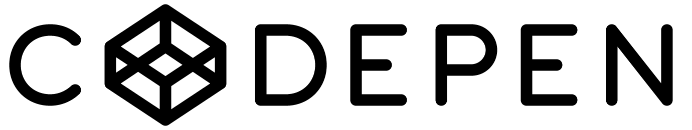

---

# For those who don't know

- CodePen is an online code playground
- It was founded in 2012
- People use it to demo and prototype projects, as well as to make art
- There's millions and millions of Pens on the site
- You can get a Pro account to have private Pens, team accounts, different modes, and moooore

—--

# Origins

- **2012:** Rails + jQuery + homegrown MVC
- **2016:** React started coming into the picture with Redux
- **Mid 2018:** CodePen decided against Redux and moved to Apollo + GraphQL

---

# chaos <3

---

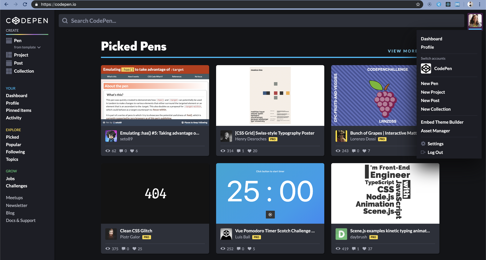

---

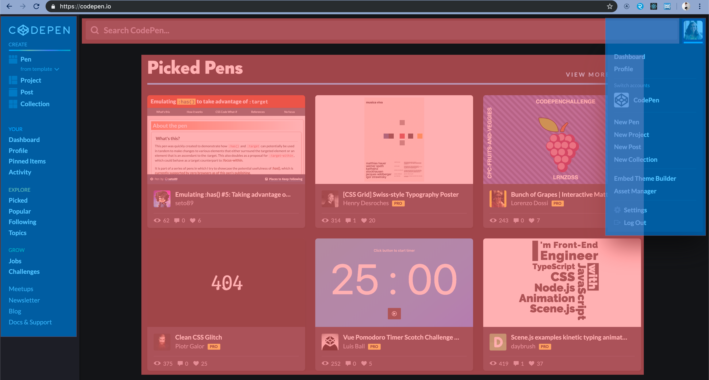

^ What's blue and doesn't weigh a lot? Light blue.

---

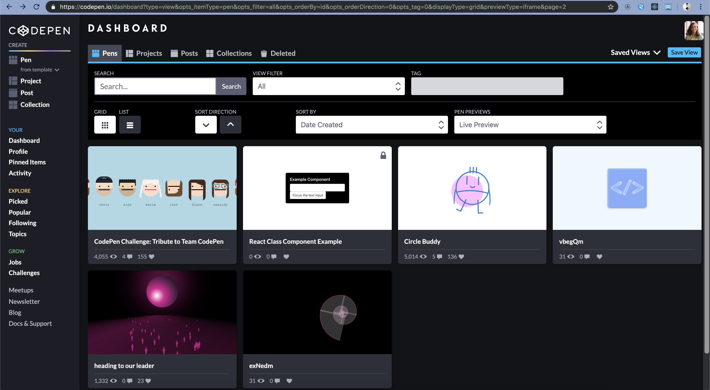

---

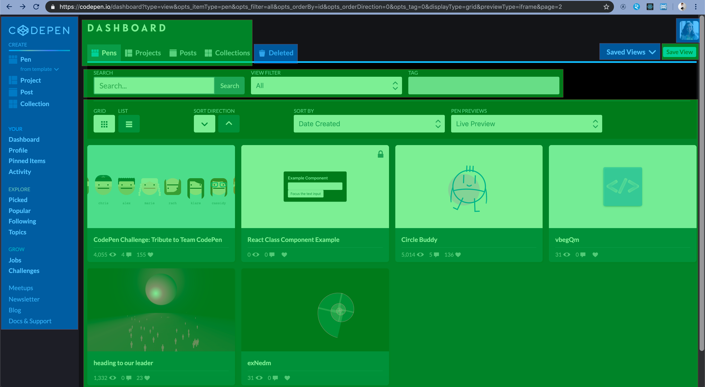

---

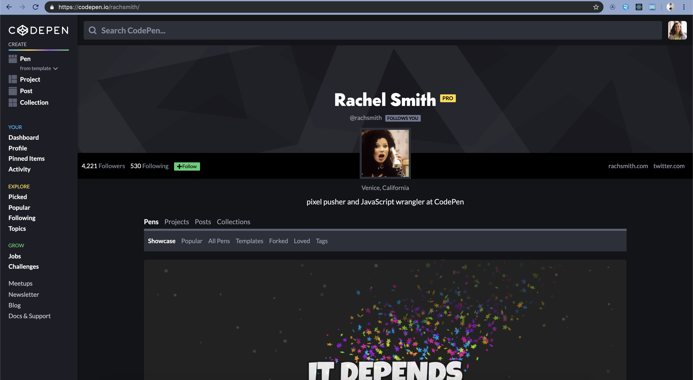

---

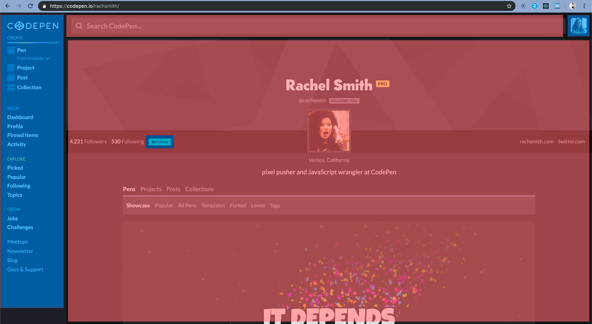

---

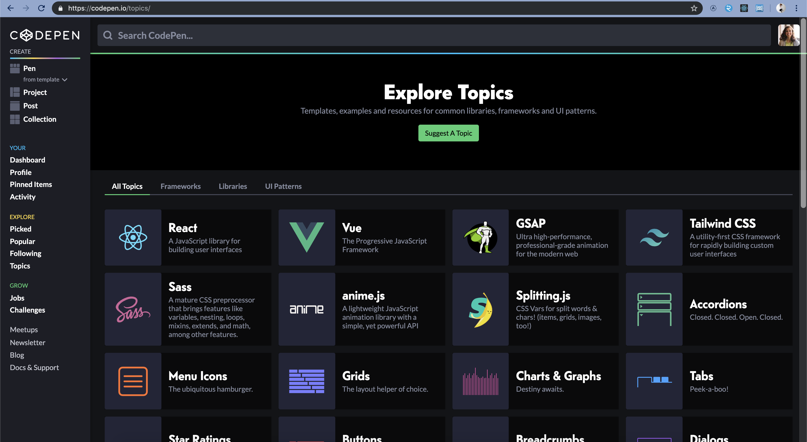

^ My husband asked the other day, "can I have my bookmark" and I cried because he still doesn't know my name

---

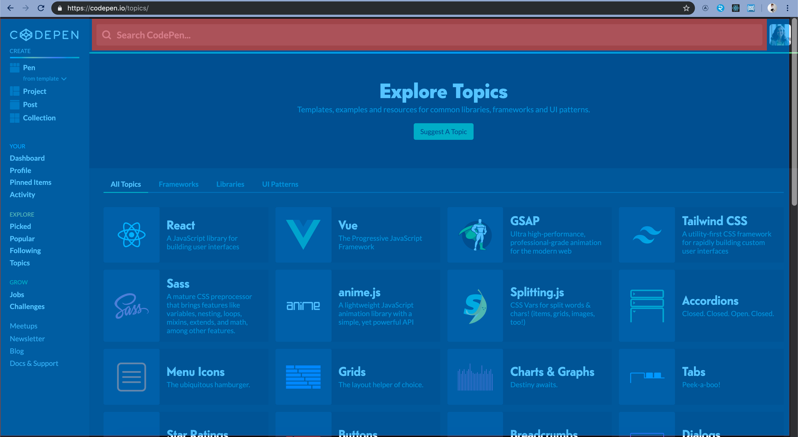

---

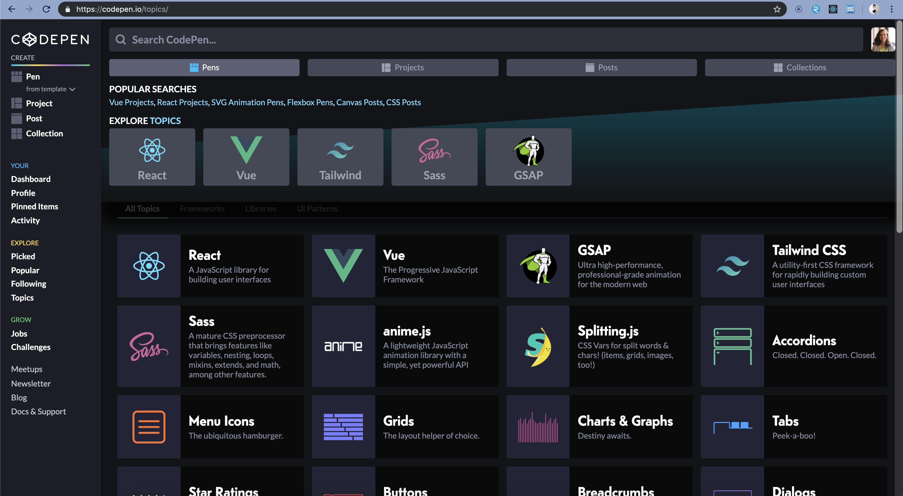

---

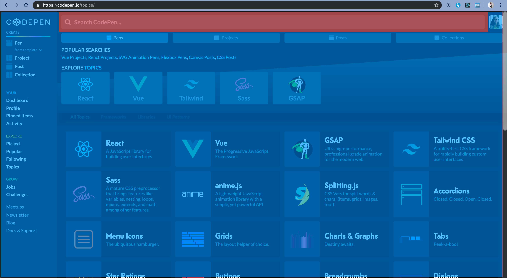

---

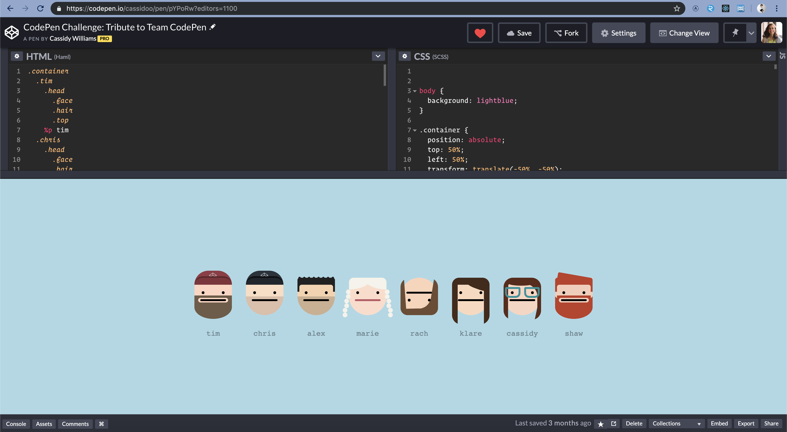

---

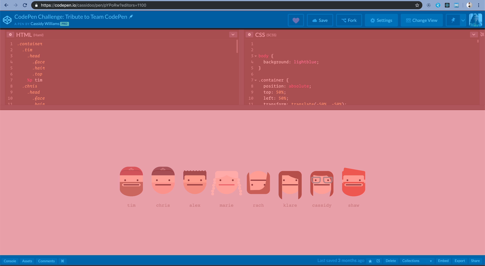

---

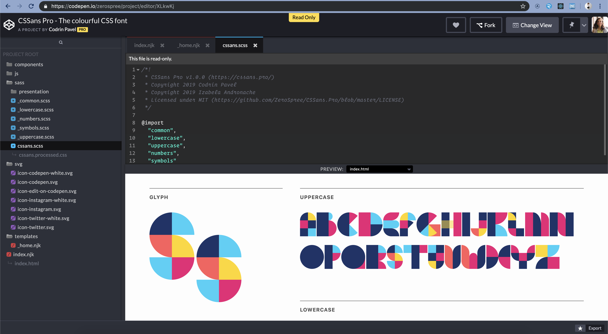

---

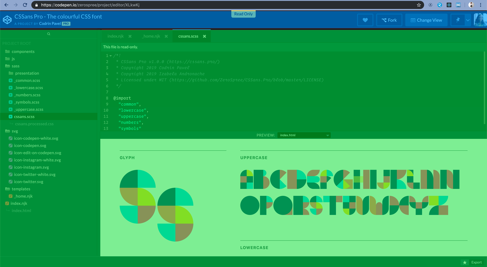

---

# It's not all bad!

---

# We've learned a ton

- Redux was a good intro for the team into React
- Redux also taught us what we don't want to do
- Apollo + GraphQL is **really** fun to write

---

# We've fully shipped some features in this new stack

- CodePen Topics
- Responsive Pen Editor
- Popups/Modals/Drawers across the site

---

# Our Apollo + GraphQL setup

---

# Our Apollo + GraphQL setup

- We have a server state and a local client state
- The front-end doesn't care where the state is
- We can make things particularly modular with hooks

^ we've been able to add modern code, including functional components and hooks
^ functional programmer's favorite animal is a lamb, duh

---

```js
const SESSION_USER = gql`
  query CreateSessionUser {
    sessionUser {
      id
      anon
    }
  }
`;
```

---

```js
const SESSION_USER = gql`
  query CreateSessionUser {
    sessionUser {
      id
      anon
      pro
    }
  }
`;
```

^ Apollo has a long way to come with error handling

---

```js
let sessionUser = useQuery(SESSION_USER);

if (sessionUser.pro) {
  return false;
}

return (
  <a
    href="/pro"
    style={{ display: 'block' }}
    onClick={!data.sessionUser.anon ? freeModalUpsell : undefined}
    id="go-pro-sidebar"
  >
    CodePen <span className="badge badge-pro">PRO</span>
  </a>
);
```

---

# Our testing setup

---

# Our testing setup

- We use Jest for unit testing
- We use Cypress for integration testing

---

```js
describe('capitalize', () => {
  it('capitalizes a string', () => {
    expect(capitalize('pen')).toEqual('Pen');
  });
  it('capitalizes an all caps string', () => {
    expect(capitalize('PROJECT')).toEqual('Project');
  });
});
```

---

```js
describe('About page', function() {
  it('Renders the page', function() {
    cy.visit('/about');

    cy.get('address.person img').then(imgs => {
      const MEMBERS_OF_CODEPEN = 8;
      expect(imgs.length).equals(MEMBERS_OF_CODEPEN);
    });
  });
});
```

^ Super jQuery-like!

---

# What's next?

---

# Things we're (slowly) working on

---

# Things we're (slowly) working on

- Routing 🙃
- Moving Projects + Dashboard to Apollo-land 🙃
- Speeding up our local testing env 🙃

---

# Things we're (quickly) working on

---

# Things we're (quickly) working on

- Exporting features
- A more social experience
- Very fun secrets 😉

---

# How you can help

- Keep on coding
- Recommend Topics for knowledge-sharing
- Send us feature requests so we can prioritize
- Get CodePen Pro

---

# **Thank you!**

## @cassidoo
