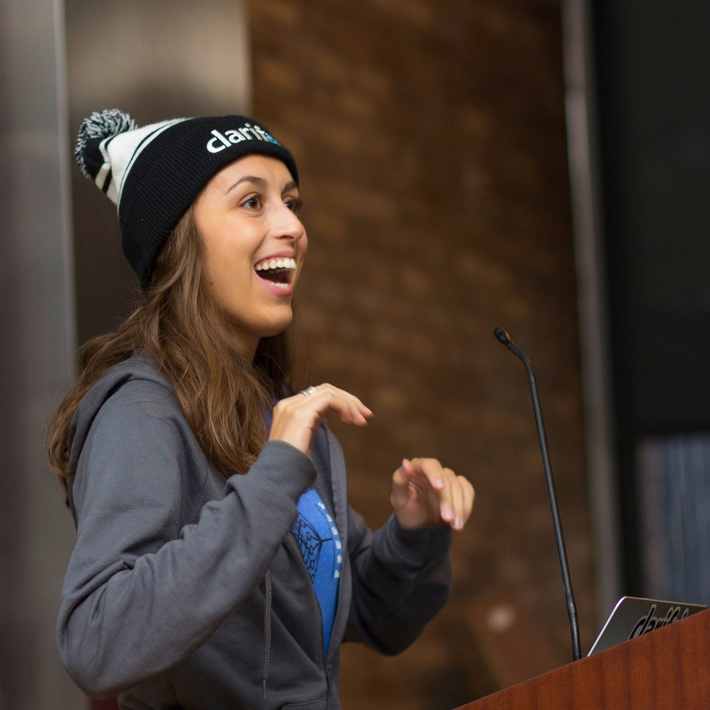
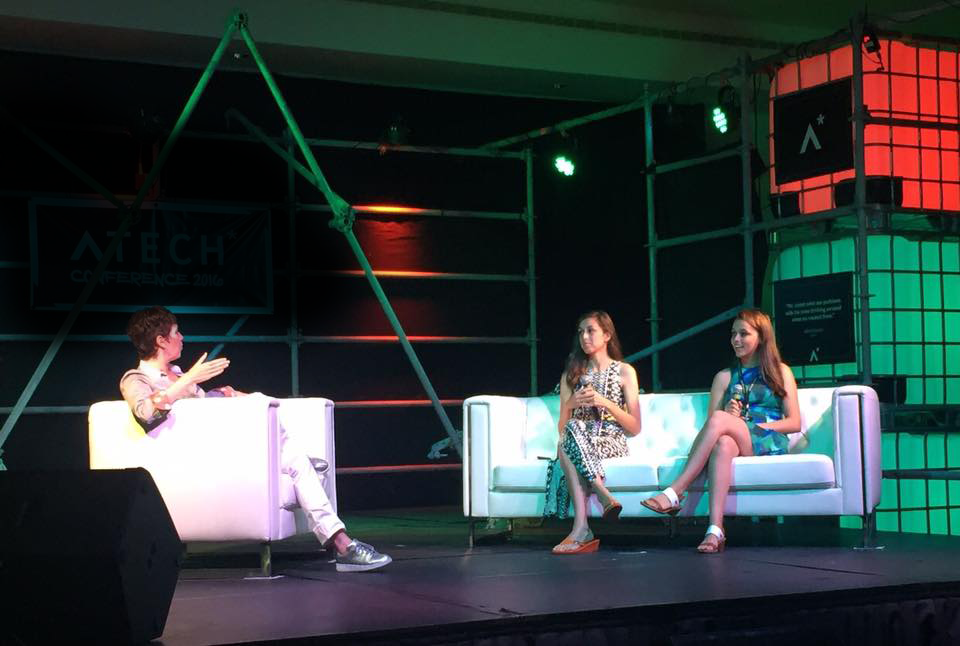
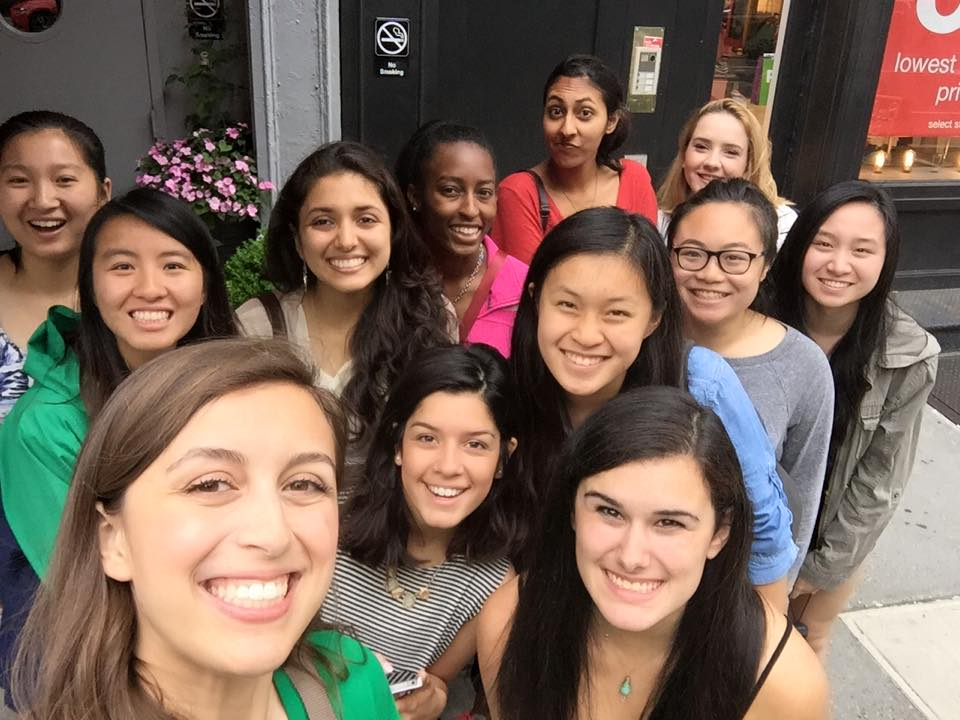

# **People First** Career Momentum

---

# Cassidy Williams
## **@cassidoo**

---

## My lil journey in tech so far

---

## The key ingredient in every move, job change, and opportunity has been **people**.

---

# Career momentum

---

## _"Career cocktail"_ - J. Kelly Hoey

- Expertise
- Professional objective 
- Networking and contacts

---

## **Expertise**

---

## **Expertise**

Hone your skills, and build your personal brand.

Know what you are good at, and what aren't you good at.

Write it down, and think about how to show this publicly.

---

## **Professional Objective**

---

### _"We need to do a better job of putting ourselves higher on our own 'to do' list."_
#### - Michelle Obama

---

## **Networking**

---

#[fit] **Networking**

---

## Networking isn't just passing out business cards anymore.

---

## What can networking look like?

---

## What can networking look like?

[.column]

- Email signature
- A Zoom meetup
- Updates on socials
- Chatting on Discord
- PR comments on open source
- Teaching a workshop
- Livestreaming code

[.column]

- Online discussions
- Speaking on a panel
- Writing a thank you note
- Moderating a community
- Referring someone to a job

---

## Combining networking with the intention of your goals is powerful.

---

### _"If you want to have a successful career, it’s important that you give back into the industry that you are passionate about."_
#### - Jennifer Johnson

---

## A well-networked person can...

- Send work your way/offer your a job
- Vouch for you/act as a reference
- Support your startup
- Help you set your direction
- Encourage you to make a change
- Cheer you on, and help you when you're struggling
- Provide access for those who don't have it

---

### _"Everything good that has happened to me has happened as a direct result of helping someone else. Everything."_
#### - Danny Trejo

---

# Be human.

---

# **Thank you!**
## @cassidoo