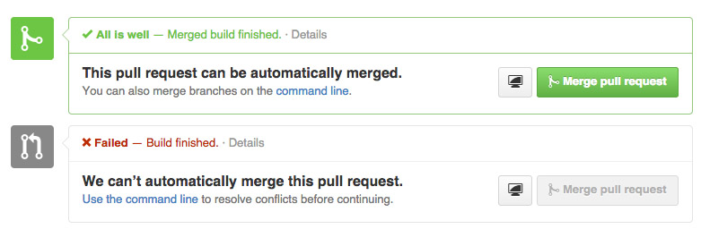

# Software Testing at *Venmo*

---

## Cassidy Williams
### Software engineer & Developer evangelist
### @venmodev

---

# We test.

---

# Our testing consists of
 - TDD
 - Linting + Continuous builds
 - Open Source!

---

# Test-Driven Development

We use various frameworks for testing, depending on the team you're on.

We write tests before we write features!

---

# Platform Team

```bash
> cd path/to/project
> nosetests
..................................
----------------------------------------------------------------------
Ran 34 tests in 1.440s

OK
```

^Our backend team uses the standard Python unit-testing framework, and we extended it with Nose

---

# Web Team

```js
> mocha
  ...............

  ✔ 15 tests complete (1ms)
```

^Our web team uses Mocha and Jasmine to write our tests, and occasionally Karma to run them. We have multiple apps within our web ecosystem, so we've experimented with different ones.

---

# iOS Team

 - Specta/expecta
 - OCMock
 - KIF (Keep It Functional)

```objc
expect(@"venmo").to.equal(@"venmo");
expect(foo).notTo.equal(1);
expect([venmo isGreat]).to.equal(YES);
expect(pi).to.equal(3.14159);

```

^Our mobile teams use several open-source frameworks for both unit and integration testing.

---

# Android Team

 - Robolectric
 - Espresso

```java

@RunWith(RobolectricTestRunner.class)
public class VenmoActivityTest {

    @Test
    public void clickingLogin_shouldStartLoginActivity() {
        VenmoActivity activity = Robolectric.setupActivity(WelcomeActivity.class);
        activity.findViewById(R.id.login).performClick();

        Intent expectedIntent = new Intent(activity, VenmoActivity.class);
        assertThat(shadowOf(activity).getNextStartedActivity()).isEqualTo(expectedIntent);
    }
}
```

---

# Linting

Whenever we make a commit to any branch or repo in Venmo, we lint our code.

---

###Linting is the process of running a program that will analyze code for potential errors.

---

## Pre-Commit

 - Lightly modified fork of *git-lint* runs on all modified files
 - *git-lint* runs *flake8*, *pylint*, and a custom static analysis tool, then combines the output
 - The entire file is linted
 - Commits are aborted on linting failures

---

# Continuous Builds

We use Jenkins for building/testing our branches continuously.

---



^ We've integrated Jenkins into our internal GitHub so that we have builds running whenever we commit to a branch. Our unit tests and checks for conflicts with master are all here.

---

## During Builds
 - Builds run on your feature branch with master merged in
 - All files you've changed are linted

 ```bash
 BRANCHPOINT=$(git merge-base HEAD origin/master) git diff -z --name-only --diff-filter='ACMRTUXB' "$BRANCHPOINT" | xargs -0 ls -dp | grep -v '/$' | xargs "$GITROOT/lint"
 ```

---

# We open source a ton of stuff!

---

```bash
$ nosetests -v --with-detecthttp myapp/
test_that_makes_request ... ok
test_with_no_request ... ok

======================================================================
FAIL: Tests made external http calls
----------------------------------------------------------------------
- myapp.tests.AppTest:

    test_that_makes_request:
      GET http://example.com

----------------------------------------------------------------------
Ran 2 tests in 0.001s

FAILED (failures=1)
```

https://github.com/venmo/nose-detecthttp
^ A nose plugin that can detect tests making external http calls

---


https://github.com/venmo/slather

---

# Questions?
