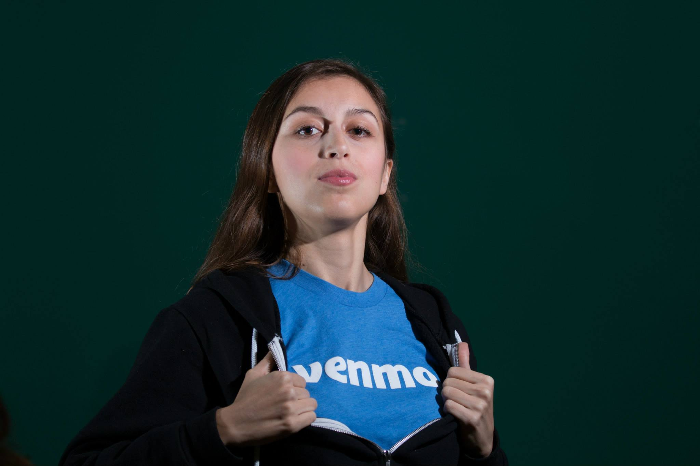
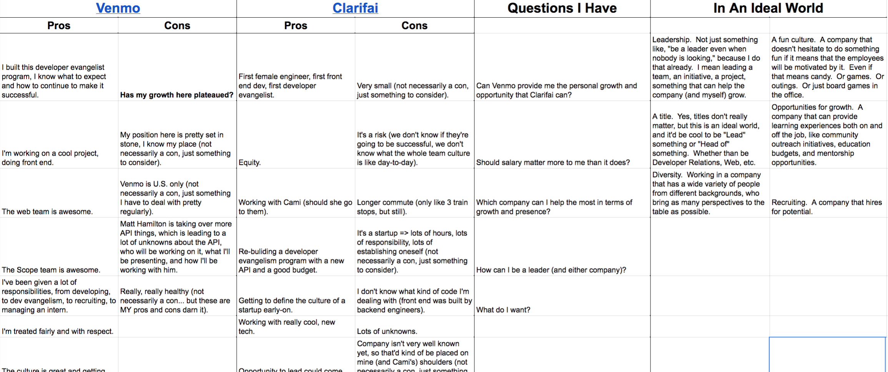
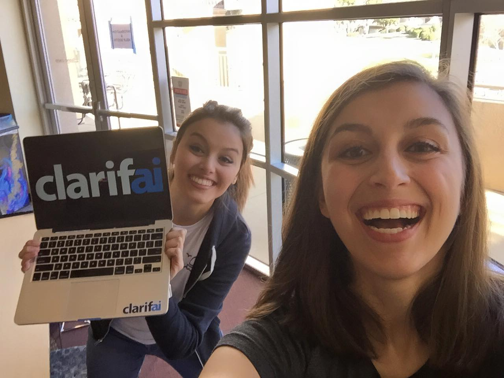

#[fit] Taking the Leap
##[fit] Leaving your comfort zone for new opportunities

---

## Cassidy Williams
### Software Engineer & Developer Evangelist at *Clarifai*

---

#Flashback

---

^ About 8 months ago, I was a Venmo employee. I LOVED it there. I was all Venmo, all the time.

^ I repped Venmo to the dev community and made us the #1 payments API in the country.

^ I was not considering leaving at all. I was comfortable, and I was happy.

---

“Comfort can be a *dangerous* thing. You stick around all the time where it’s safe and nothing ever changes, and before you know it, you get set in your ways and *you quit learning*, *you quit changing*, *you don’t grow* anymore.”
- Frank E. Peretti

---

## I didn't realize this was my situation.

^ I figured that the "dream job" that I had was the ideal.

^ I was good at it, I was able to do what I knew and thrive doing it.

^ I asked for a raise and my manager assured me he'd figure something out. I was content.

---

## Then, in comes

^ Clarifai is an artificial intelligence startup here in NYC.

^ The founder had reached out asking if I'd be interested in a gig, and I politely declined.

^ He was persistent, so I said I'd grab coffee with him just as a friendly gesture. That turned into an interview.

---

^ I ended up making a massive spreadsheet of pros and cons and things I should consider.

^ This is a small portion of it.  I sent it to both Clarifai and Venmo to be totally transparent.

^ After going through it with friends, family, coworkers, other dev evangelists, I had to make the tough decision, and I left Venmo.

---

^ I'm so glad I ended up going to Clarifai.

^ I've been able to learn so much about new technologies, and I've been able to do more outreach than ever before.

^ My sister also joined the company, and we get to work together on some awesome initiatives.

^ It's hard work, and I don't always know what I'm doing, but I think that's the way it's supposed to be.

---

# When should you take a leap?

- Are you the smartest person in the room?
- Are you comfortable?
- Does your company appreciate your work?
- What is holding you back?

---

## Cassidy Williams
### @cassidoo
