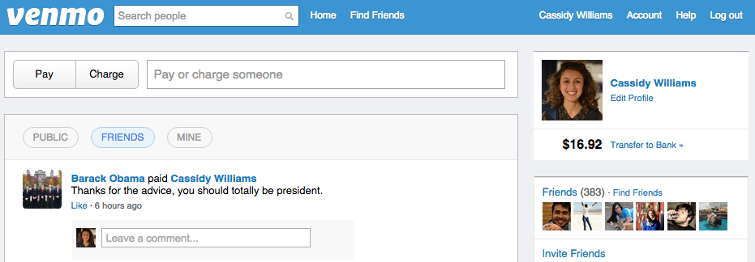
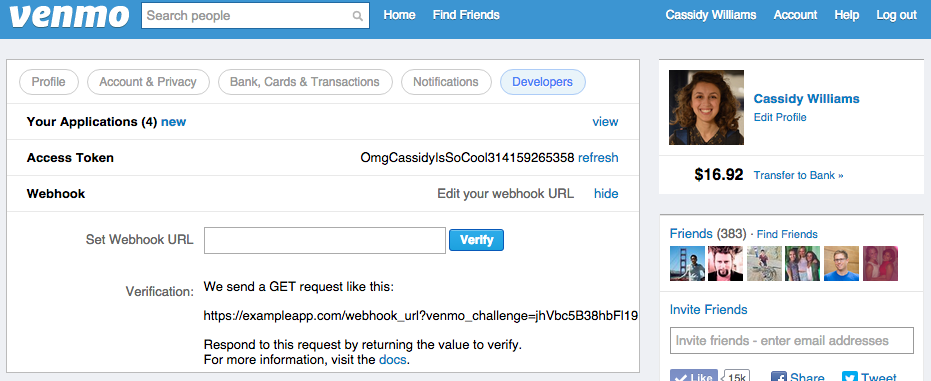
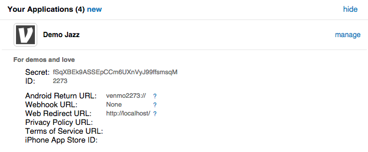
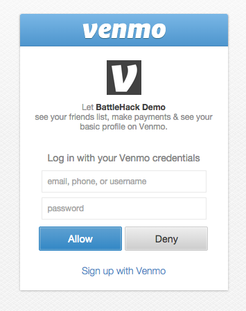

# Venmo Developer API

---

#There's 4 ways to integrate Venmo

---

#Payment Links

---

# REST API

---

#OAuth

---

#Drop In

---

#[fit]We're going to talk about
#_OAuth and Payment Links._

---

#OAuth is cray easy.

Go to *developer.venmo.com*

Click Authentication

Party

---

---

---

---

`https://api.venmo.com/v1/oauth/authorize?client_id=<client_id>&scope=<scopes>`

---

---

##*Users* Endpoint
##*Payments* Endpoint

---

##developer.venmo.com

---

#Payment Links

---

#Payment Links are cray easy.

Go to *developer.venmo.com*

Click Payment Links

Party

---

#*Remember*
#[fit]Venmo is person-to-person!

---

#Go to

*github.com/venmo*

for code samples, tutorials, and working examples

---

developer.venmo.com
@venmodev
