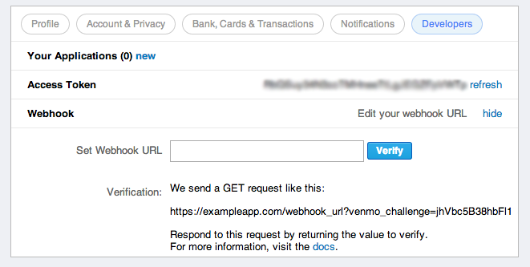
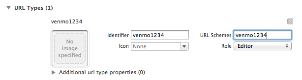

# Venmo Developer API

---

#There's 3 ways to integrate Venmo

---

# REST API


---

#OAuth


---

#Drop In


---

#We're going to talk about Drop Ins.
In particular, we're going to talk about the Venmo iOS SDK.

Anybody can do this.

I don't know anything about iOS and I did this.

---

Use CocoaPods and add this to your Podfile

`pod 'Venmo-iOS-SDK', '~>1.0.0'`

---

#Register your application
Go to venmo.com
Edit your Profile
Developers Tab



---

Get your app ID and stick it in your XCode project URL types with the word "venmo"



---

Initialize the SDK

`#import <Venmo-iOS-SDK/Venmo.h>`

---

Include your app ID and secret in the app delegate 

```objc
[Venmo startWithAppId:@"VENMO_APP_ID" secret:@"VENMO_APP_SECRET" name:@"VENMO_APP_NAME"];
```

---

#Work with it!

---

Check if a user has Venmo

```objc
if (![Venmo isVenmoAppInstalled]) {
    [[Venmo sharedInstance] setDefaultTransactionMethod:VENTransactionMethodAPI];
}
else {
    [[Venmo sharedInstance] setDefaultTransactionMethod:VENTransactionMethodAppSwitch];
}
```

---

Request permissions

```objc
[[Venmo sharedInstance] requestPermissions:@[VENPermissionMakePayments,
                                             VENPermissionAccessProfile]
                     withCompletionHandler:^(BOOL success, NSError *error) {
    if (success) {
        // :)
    }
    else {
        // :(
    }
}];
```

---

And of course, send a payment

```objc
[[Venmo sharedInstance] sendPaymentTo:@"Venmo user"
                           amount:1 // this is in cents
                           note:@"Transaction note!"
                    completionHandler:^(VENTransaction *transaction, BOOL success, NSError *error) {
    if (success) {
        NSLog(@"Transaction succeeded!");
    }
    else {
        NSLog(@"Transaction failed: %@", [error localizedDescription]);
    }
}];
```

---

#Go to

*github.com/venmo*

for code samples, tutorials, and working examples

---

developer.venmo.com
developer@venmo.com
@venmodev
