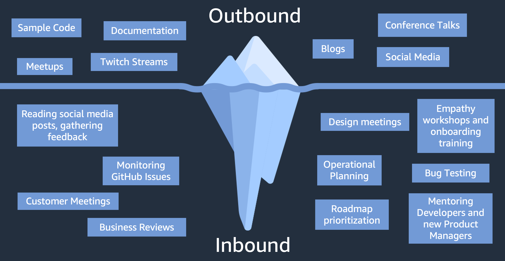

# What is Cassidy's actual job?

---

Nobody actually seems to know so I figure I'll break it down for you.

---

## Fancy title:

### **Senior Director of Developer Advocacy**

---

## In plain English:

### I tell people how to code better

---

# Breaking it down

---

## Developer

---

Developers write code.

---

Code is not 01101000 01101001.

---

It's more like:

```
if something happens
  another thing happens
```

---

In larger systems, it's more like:

```js
logInUser(Nadia)

if (Nadia is logged in) {
  checkUpdates(Nadia)
  displayProfile(Nadia) // avatar, status, preferences
}

```

(And then assume it's a part of a larger system of more users)

---

There's different languages for different types of applications.

- JavaScript for websites
- Swift for Apple apps
- Kotlin or Java for Android
- C for operating systems (like Windows, MacOS, Linux)
- Python for AI
- Legoscript for Lego Mindstorm

---

How do you pick a language? It Depends™

---

There's different "best practices" for different types of development.

---

A different piece of software can use one language, or three, or five, it just depends on what you build!

---

Some people specialize in just one language, some more. They're relatively easy to translate once you know one or two!

---

Developers use different tools to write different languages, or plugins, or computers, or systems (etc), and this is called their **"stack"**

---

Any questions about this before we move on?

---

## Advocacy

---

"Advocating for developers" has morphed over the years.

---

This role used to be called "developer evangelist" because people were trying to "evangelize" their tech products to developers.

---

Kind of like "the marketer on the dev team" or "the dev on the marketing team"

---

But over time, it turned into "advocate" because the role expanded.

---



---

The very high level: we advocate for developers outside of the company, to teams inside of the company, and we advocate for our company to developers.

---

Companies want their tech to be a part of the developer **"stack"**, and so as a company, we have to identify and solve developer problems.

---

"The voice of the developer"

---

Any questions on this part?

---

## Senior Director

---

This just means I manage developer advocates, pretty much.

---

I have a small team that specializes in different types of content creation, languages, and technologies, and we both represent them internally, and speak to them externally.

---

Most advocacy teams have a very "player-coach" model of management, so managers are expected to stay technical, do content work, present talks, do meetings, etc, in addition to managing the team.

---

## My day-to-day

---

It is impossible to say

---

But also: my-day-to-day varies wildly on the season

---

Most times I'm doing regular management tasks (like discussing careers and stuff), or anything you saw in the iceberg diagram

---

"Conference season" means I'm speaking and traveling, and in-between I'm prepping talks and getting to know which technologies for different stacks I should know

---

"Crunch time" means that a launch is coming and everyone has to make a bunch of last-minute content and changes (like demo videos, prepping for social media posts, livestreaming, etc).

---

## And that is Cassidy's job

---

Are there any FINAL questions?

---

Bye
