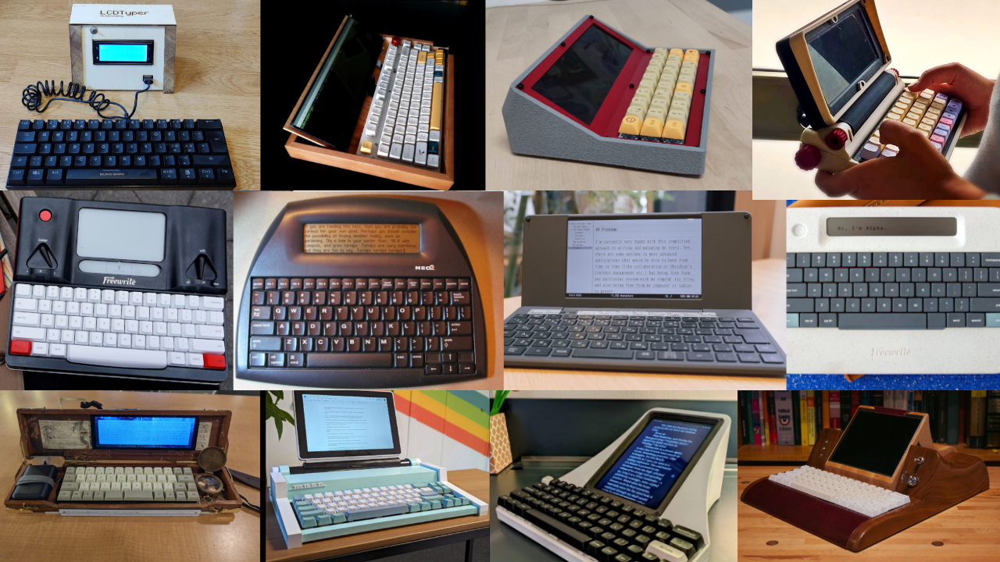
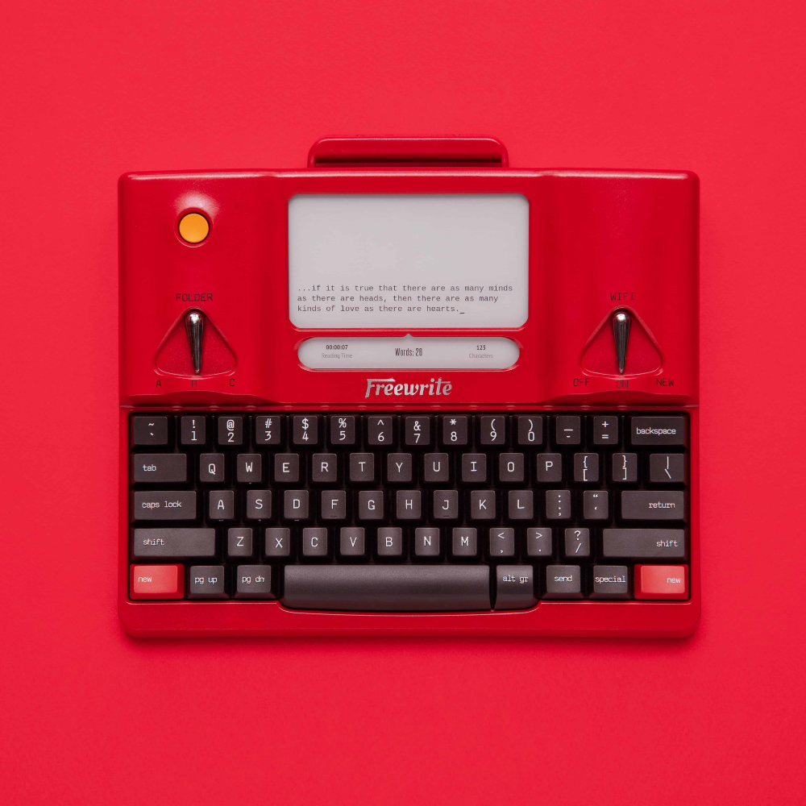
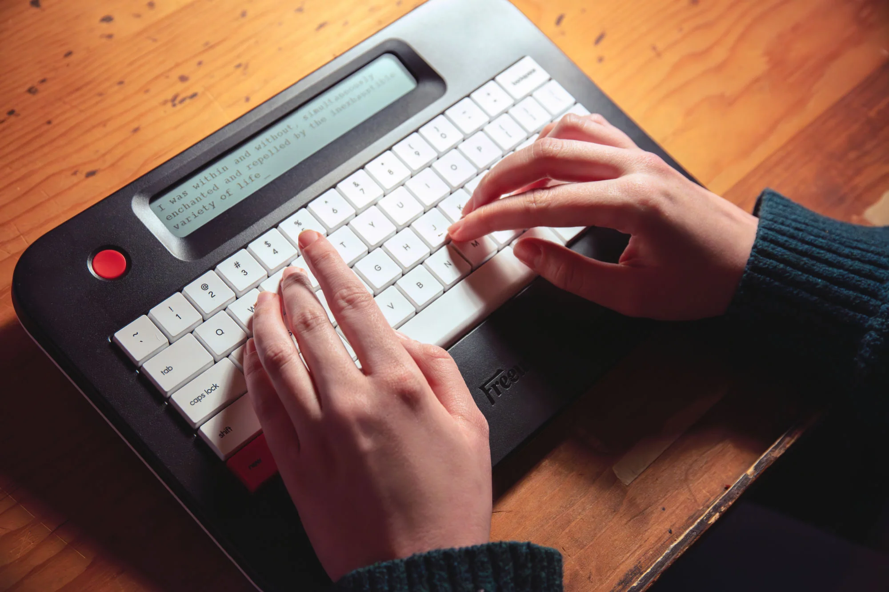

# Writer Decks!

---

# Hi I'm Cassidy

## aka _@cassidoo_

## I designed DSA Scrabble, DSS Tecla, Astrolokeys, and PBT Jeju

---

## When I open up my computer, I am one click away from writing.

---

## When I open up my computer, I am one click away from writing.

## And everything else in the world.

---

## Enter: The wonderful world of writer decks!

---

## I first was "exposed" to the concept of the writer deck via the Freewrite.

---

## The Freewrite was not the first writer deck!

---

## The AlphaSmart

---

## The Freewrite (again, but _alpha_)

---

## Let's talk about price.

---

## Open source! Openness! Build and tinker!

---

## Micro Journal

### cassidoo.co/post/micro-journal

---

## We are at Keycon, chances are you might want to use your own keyboard.

---

## The BYOK

---

## These tools are _not_ anti-technology.

---

## Technology should ultimately benefit humans, which means you control what you want.

---

## You sit down and write, and it doesn't ask anything more of you.

---

## Thank you!
