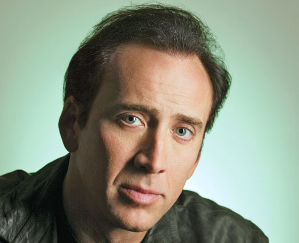
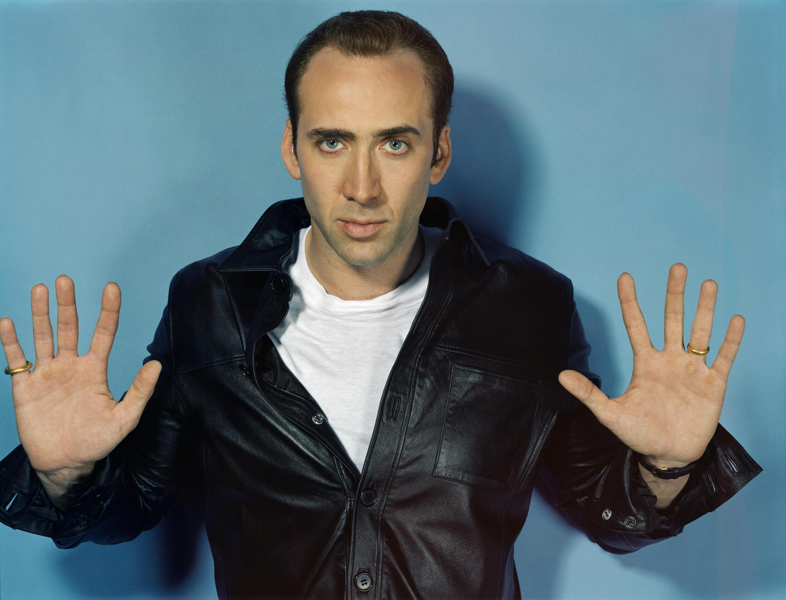
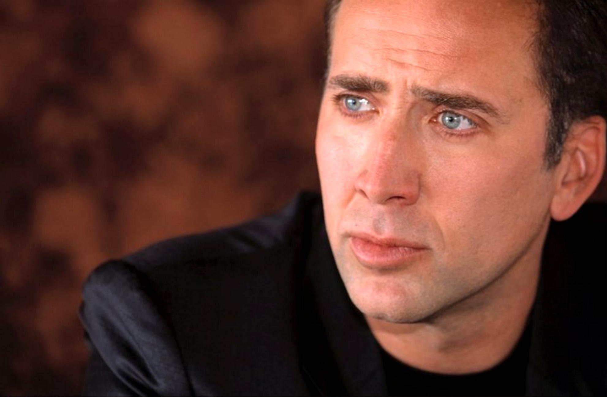
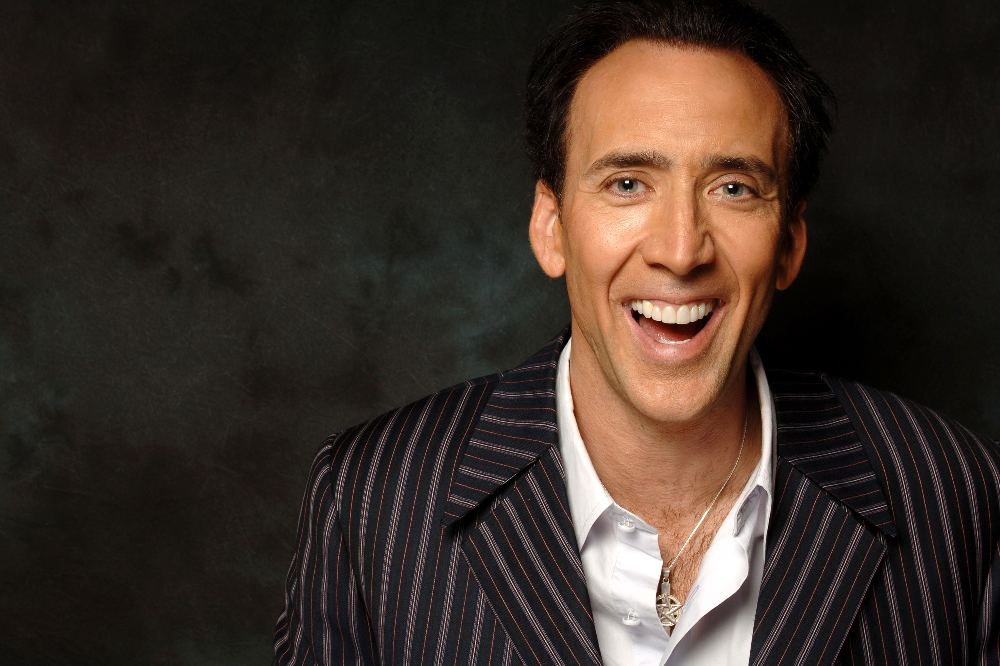

#[fit]Your 
#[fit]_**Personal**_
#[fit]Brand

--- 

#[fit]_Cassidy Williams_
#[fit]Software Engineer _**&**_ Developer Evangelist
##Venmo

---

##What is a _personal brand_, anyway?

---

##It's how the _world_ sees you.

---

##It's your _reputation_.

---

##It's _what_ you do and _how_ you do it.

^ By having a personal brand, you can show that you will clearly and consistently deliver a memorable experience to recruiters, companies, customers, and anyone else with whom you interact.
^ Those memorable experiences are the ones that open doors to the best opportunities.

---

##How the heck do I get one of those?

---

##I'll tell you.

^ Because you're great.

---

##First, let's answer some _questions_.

---

##What are you _passionate_ about?

###This can be anything.

####LEGOs. Burritos. Computers. Law & Order.

####Anything.

---

##What _strengths_ do people see in me?

^ To save time, look into Nick Cage's eyes

---

^ Now ask the person you're looking at, what strengths do you see in me?
^ Not just technical strengths. Social ones, professional ones, anything.

---

##What is your _go-to skill_ when overcoming obstacles?

^ This could be anything.  What do you do when you're facing something tough?

---

##_Why_ have you been successful in the past?

###In your most successful teams, projects, or ventures, _what_ did you do?

---

##Now, you know what you're good at.

^ You have a general list of skills and strengths in mind. That's great.

---

##But, which of these things do you actually _WANT_ to do everyday?

---

##Which skills do you _NOT_ want to use?

---

##What's missing?

^ Ask yourself, what do I need to do to fill in what I don't know, yet?

---

##What about _weaknesses_?

^ Everyone has weaknesses.  Whether it be lack of interest, lack of time, lack of education, or even overusing your other abilities, the weaknesses are there.
^ This isn't a bad thing! This is knowing yourself.

---

##Everyone with a strong brand knows what they _can_ do, and what they _can't_ do.

^ And each of those are just as important as the other.

---

#_**Now what?**_

^ This is a lot of talking and not a lot of doing.
^ What do you pursue, now that you understand what you can and can't do?

---

##You can do _anything_ you want.

---

##Ask yourself the questions you hear in cheesy _**ICE**_ breakers.

^ Our friend Nick likes to stop and think about this all the time.

---

^ If money weren't an object, what would you do?
^ What are your favorite activities?
^ What are your friends like?

---

##But you also have to think about deeper stuff, too.

^ Let's get deep.

---

^ What kind of future do you want?
^ What gives you a sense of purpose now?
^ Why are you here today?

---

##Following your _passions_, guided by your _values_, leads to _enthusiasm_.

^ This enthusiasm is contagious, and will inspire and engage those around you.

---

##Okay, we've asked a _lot_ of questions.

---

##Now it's time to _put it all together_.

---

##You know what makes you _unique_, and you know what you _want_.

---

##Now, _share_ it!!

^ Let your voice be the one that stands out from the crowd.

---

##Your brand is _powerful_.

^ Your brand is your most powerful tool for making an impact,
^ and for getting the opportunities that are best for you.
^ Add that to your technical skills, and you can't lose.

---

^ So, without further ado

---

#_Good luck today!_
